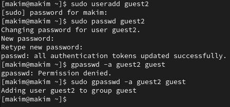
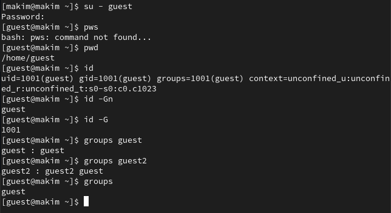
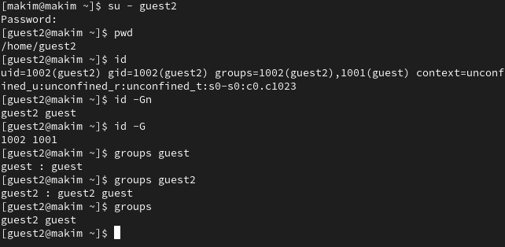
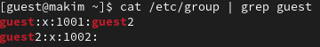
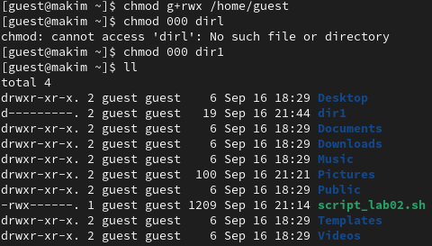
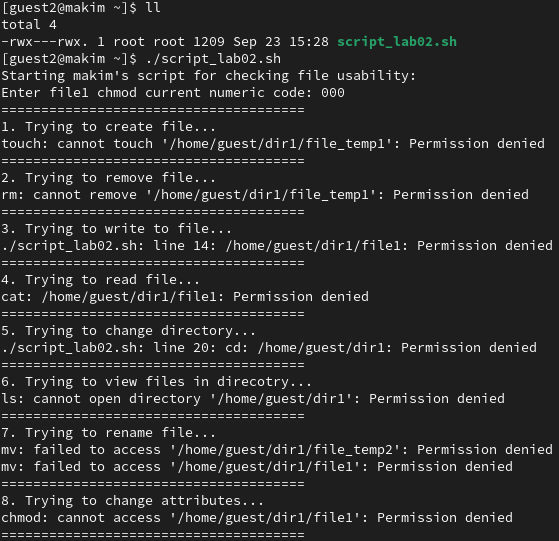
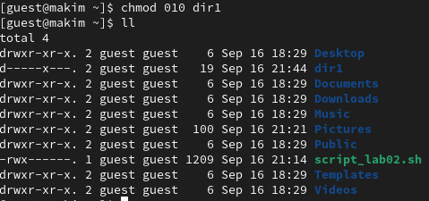
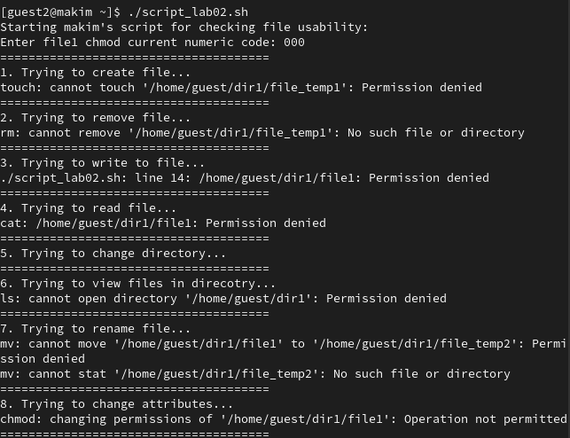
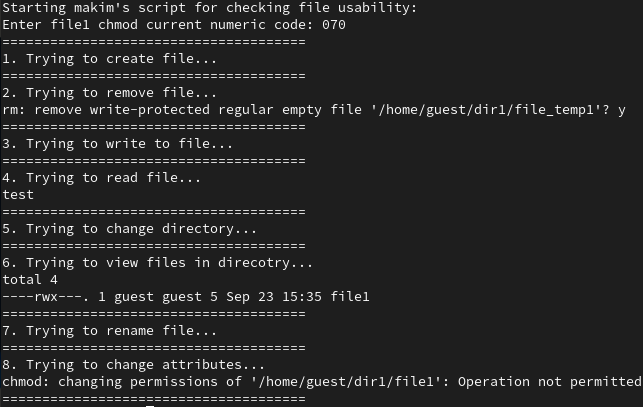

---
## Front matter
lang: ru-RU
title: Лабораторная работа №3
subtitle: Дискреционное разграничение прав в Linux. Два пользователя
author:
  - Ким М. А.
institute:
  - Российский университет дружбы народов, Москва, Россия
date: 23 сентября 2023

## i18n babel
babel-lang: russian
babel-otherlangs: english

## Fonts
mainfont: PT Serif
romanfont: PT Serif
sansfont: PT Sans
monofont: PT Mono
mainfontoptions: Ligatures=TeX
romanfontoptions: Ligatures=TeX
sansfontoptions: Ligatures=TeX,Scale=MatchLowercase
monofontoptions: Scale=MatchLowercase,Scale=0.9

## Formatting pdf
toc: false
toc-title: Содержание
slide_level: 2
aspectratio: 169
section-titles: true
theme: metropolis
header-includes:
 - \metroset{progressbar=frametitle,sectionpage=progressbar,numbering=fraction}
 - '\makeatletter'
 - '\beamer@ignorenonframefalse'
 - '\makeatother'
---

# Информация

## Докладчик

:::::::::::::: {.columns align=center}
::: {.column width="70%"}

  * Ким Михаил Алексеевич
  * студент уч. группы НФИбд-01-20
  * Российский университет дружбы народов
  * [1032201664@pfur.ru](mailto:1032201664@pfur.ru)
  * <https://github.com/exmanka>

:::
::: {.column width="30%"}

:::
::::::::::::::

# Вводная часть

## Актуальность

- Необходимость навыков работы с различными ОС, git, Markdown.

## Объект и предмет исследования

- Операционная система Rocky Linux
- Атрибуты файлов и директорий в Linux
- Язык разметки Markdown

## Цели и задачи

- Получение практических навыков работы в консоли с атрибутами файлов для групп пользователей.

# Процесс выполнения работы
## Выполнение заданий. 1

:::::::::::::: {.columns align=top}
::: {.column width="25%"}

:::
::: {.column width="25%"}

:::
::: {.column width="25%"}

:::
::: {.column width="25%"}

:::
::::::::::::::

## Выполнение заданий. 2

:::::::::::::: {.columns align=top}
::: {.column width="50%"}

:::
::: {.column width="50%"}

:::
::::::::::::::

## Bash-скрипт

:::::::::::::: {.columns align=top}
::: {.column width="25%"}

:::
::: {.column width="25%"}

:::
::: {.column width="25%"}

:::
::: {.column width="25%"}

:::
::::::::::::::

## Результирующая таблица 1.

| Права д. | Права ф. | Создание ф. | Удаление ф. | Запись в ф. | Чтение ф. | Смена д. | Просмотр ф. в д. | Переименов. ф. | Смена атр. ф. |
|---|---|---|---|---|---|---|---|---|---|
| d--------- (000) | ---------- (000) | - | - | - | - | - | - | - | - |
| d-----x--- (010) | ---------- (000) | - | - | - | - | + | - | - | + |
| d----w---- (020) | ---------- (000) | - | - | - | - | - | - | - | - |
| d----wx--- (030) | ---------- (000) | + | + | - | - | + | - | + | + |
| d---r----- (040) | ---------- (000) | - | - | - | - | - | + | - | - |
| d---r-x--- (050) | ---------- (000) | - | - | - | - | + | + | - | + |
| d---rw---- (060) | ---------- (000) | - | - | - | - | - | + | - | - |
| d---rwx--- (070) | ---------- (000) | + | + | - | - | + | + | + | + |
| d--------- (000) | ------x--- (010) | - | - | - | - | - | - | - | - |
| d-----x--- (010) | ------x--- (010) | - | - | - | - | + | - | - | + |
| d----w---- (020) | ------x--- (010) | - | - | - | - | - | - | - | - |
| d----wx--- (030) | ------x--- (010) | + | + | - | - | + | - | + | + |
| d---r----- (040) | ------x--- (010) | - | - | - | - | - | + | - | - |
| d---r-x--- (050) | ------x--- (010) | - | - | - | - | + | + | - | + |
| d---rw---- (060) | ------x--- (010) | - | - | - | - | - | + | - | - |
| d---rwx--- (070) | ------x--- (010) | + | + | - | - | + | + | + | + |
| d--------- (000) | -----w---- (020) | - | - | - | - | - | - | - | - |
| d-----x--- (010) | -----w---- (020) | - | - | + | - | + | - | - | + |
| d----w---- (020) | -----w---- (020) | - | - | - | - | - | - | - | - |
| d----wx--- (030) | -----w---- (020) | + | + | + | - | + | - | + | + |
| d---r----- (040) | -----w---- (020) | - | - | - | - | - | + | - | - |
| d---r-x--- (050) | -----w---- (020) | - | - | + | - | + | + | - | + |
| d---rw---- (060) | -----w---- (020) | - | - | - | - | - | + | - | - |
| d---rwx--- (070) | -----w---- (020) | + | + | + | - | + | + | + | + |
| d--------- (000) | -----wx--- (030) | - | - | - | - | - | - | - | - |
| d-----x--- (010) | -----wx--- (030) | - | - | + | - | + | - | - | + |
| d----w---- (020) | -----wx--- (030) | - | - | - | - | - | - | - | - |
| d----wx--- (030) | -----wx--- (030) | + | + | + | - | + | - | + | + |
| d---r----- (040) | -----wx--- (030) | - | - | - | - | - | + | - | - |
| d---r-x--- (050) | -----wx--- (030) | - | - | + | - | + | + | - | + |
| d---rw---- (060) | -----wx--- (030) | - | - | - | - | - | + | - | - |
| d---rwx--- (070) | -----wx--- (030) | + | + | + | - | + | + | + | + |
| d--------- (000) | ----r----- (040) | - | - | - | - | - | - | - | - |
| d-----x--- (010) | ----r----- (040) | - | - | - | + | + | - | - | + |
| d----w---- (020) | ----r----- (040) | - | - | - | - | - | - | - | - |
| d----wx--- (030) | ----r----- (040) | + | + | - | + | + | - | + | + |
| d---r----- (040) | ----r----- (040) | - | - | - | - | - | + | - | - |
| d---r-x--- (050) | ----r----- (040) | - | - | - | + | + | + | - | + |
| d---rw---- (060) | ----r----- (040) | - | - | - | - | - | + | - | - |
| d---rwx--- (070) | ----r----- (040) | + | + | - | + | + | + | + | + |
| d--------- (000) | ----r-x--- (050) | - | - | - | - | - | - | - | - |
| d-----x--- (010) | ----r-x--- (050) | - | - | - | + | + | - | - | + |
| d----w---- (020) | ----r-x--- (050) | - | - | - | - | - | - | - | - |
| d----wx--- (030) | ----r-x--- (050) | + | + | - | + | + | - | + | + |
| d---r----- (040) | ----r-x--- (050) | - | - | - | - | - | + | - | - |
| d---r-x--- (050) | ----r-x--- (050) | - | - | - | + | + | + | - | + |
| d---rw---- (060) | ----r-x--- (050) | - | - | - | - | - | + | - | - |
| d---rwx--- (070) | ----r-x--- (050) | + | + | - | + | + | + | + | + |
| d--------- (000) | ----rw---- (060) | - | - | - | - | - | - | - | - |
| d-----x--- (010) | ----rw---- (060) | - | - | + | + | + | - | - | + |
| d----w---- (020) | ----rw---- (060) | - | - | - | - | - | - | - | - |
| d----wx--- (030) | ----rw---- (060) | + | + | + | + | + | - | + | + |
| d---r----- (040) | ----rw---- (060) | - | - | - | - | - | + | - | - |
| d---r-x--- (050) | ----rw---- (060) | - | - | + | + | + | + | - | + |
| d---rw---- (060) | ----rw---- (060) | - | - | - | - | - | + | - | - |
| d---rwx--- (070) | ----rw---- (060) | + | + | + | + | + | + | + | + |
| d--------- (000) | ----rwx--- (070) | - | - | - | - | - | - | - | - |
| d-----x--- (010) | ----rwx--- (070) | - | - | + | + | + | - | - | + |
| d----w---- (020) | ----rwx--- (070) | - | - | - | - | - | - | - | - |
| d----wx--- (030) | ----rwx--- (070) | + | + | + | + | + | - | + | + |
| d---r----- (040) | ----rwx--- (070) | - | - | - | - | - | + | - | - |
| d---r-x--- (050) | ----rwx--- (070) | - | - | + | + | + | + | - | + |
| d---rw---- (060) | ----rwx--- (070) | - | - | - | - | - | + | - | - |
| d---rwx--- (070) | ----rwx--- (070) | + | + | + | + | + | + | + | + |

## Результирующая таблица 2.

| Операция               | Мин. права на д.                | Мин. права на ф.          |
|------------------------|---------------------------------|---------------------------|
| Создание файла         | d----wx--- (030)                | ---------- (000)          |
| Удаление файла         | d----wx--- (030)                | ---------- (000)          |
| Чтение файла           | d-----x--- (010)                | ----r----- (040)          |
| Запись в файл          | d-----x--- (010)                | -----w---- (020)          |
| Переименование файла   | d----wx--- (030)                | ---------- (000)          |
| Создание поддиректории | d----wx--- (030)                | ---------- (000)          |
| Удаление поддиректории | d----wx--- (030)                | ---------- (000)          |

# Результаты

- Выполнены все необходимые задания.

## Вывод

Получены практические навыкы работы в консоли с атрибутами файлов для групп пользователей.