---
## Front matter
lang: ru-RU
title: Лабораторная работа №2
subtitle: Дискреционное разграничение прав в Linux. Основные атрибуты
author:
  - Ким М. А.
institute:
  - Российский университет дружбы народов, Москва, Россия
date: 16 сентября 2023

## i18n babel
babel-lang: russian
babel-otherlangs: english

## Fonts
mainfont: PT Serif
romanfont: PT Serif
sansfont: PT Sans
monofont: PT Mono
mainfontoptions: Ligatures=TeX
romanfontoptions: Ligatures=TeX
sansfontoptions: Ligatures=TeX,Scale=MatchLowercase
monofontoptions: Scale=MatchLowercase,Scale=0.9

## Formatting pdf
toc: false
toc-title: Содержание
slide_level: 2
aspectratio: 169
section-titles: true
theme: metropolis
header-includes:
 - \metroset{progressbar=frametitle,sectionpage=progressbar,numbering=fraction}
 - '\makeatletter'
 - '\beamer@ignorenonframefalse'
 - '\makeatother'
---

# Информация

## Докладчик

:::::::::::::: {.columns align=center}
::: {.column width="70%"}

  * Ким Михаил Алексеевич
  * студент уч. группы НФИбд-01-20
  * Российский университет дружбы народов
  * [1032201664@pfur.ru](mailto:1032201664@pfur.ru)
  * <https://github.com/exmanka>

:::
::: {.column width="30%"}

:::
::::::::::::::

# Вводная часть

## Актуальность

- Необходимость навыков работы с различными ОС, git, Markdown.

## Объект и предмет исследования

- Операционная система Rocky Linux
- Атрибуты файлов и директорий в Linux
- Язык разметки Markdown

## Цели и задачи

- Полученить практических навыков работы в консоли с атрибутами файлов, закрепление теоретических основ дискреционного разграничения доступа в современных системах с открытым кодом на базе ОС Linux.

# Процесс выполнения работы
## Выполнение заданий. 1

:::::::::::::: {.columns align=top}
::: {.column width="25%"}

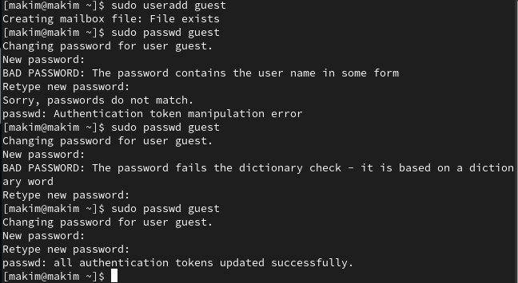

:::
::: {.column width="25%"}

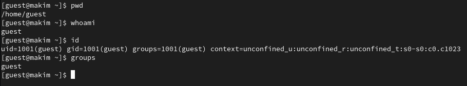

:::
::: {.column width="25%"}

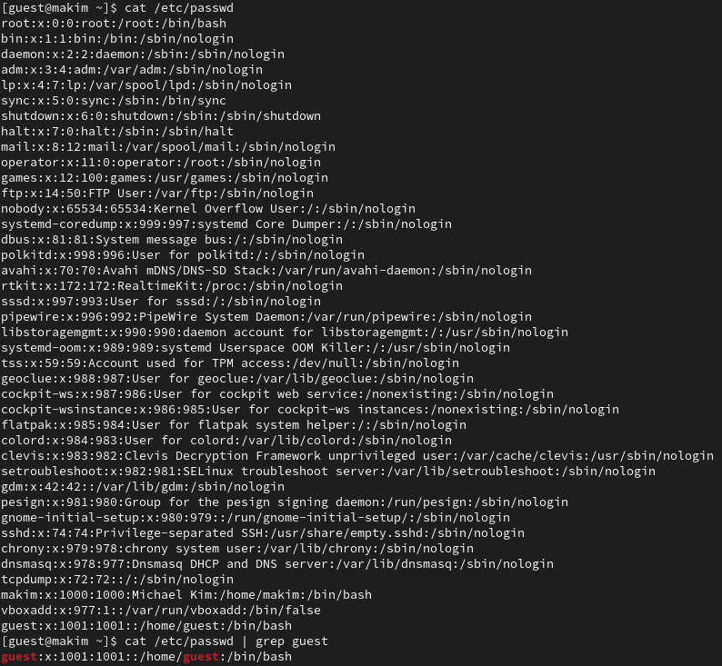

:::
::: {.column width="25%"}

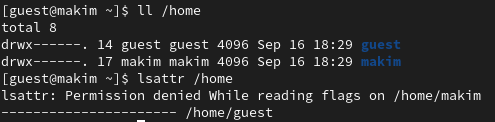

:::
::::::::::::::

## Выполнение заданий. 2

:::::::::::::: {.columns align=top}
::: {.column width="25%"}

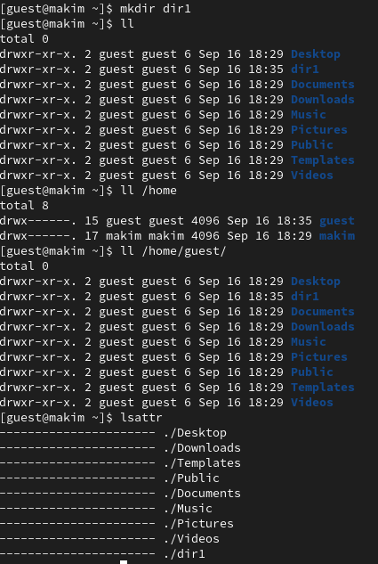

:::
::: {.column width="25%"}

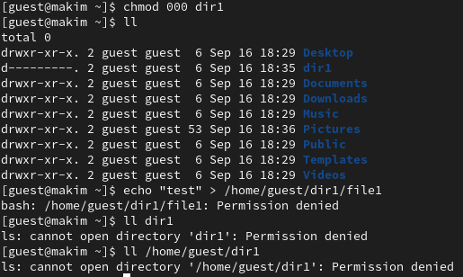

:::
::: {.column width="25%"}

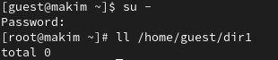

:::
::: {.column width="25%"}

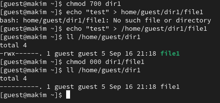

:::
::::::::::::::

## Bash-скрипт

:::::::::::::: {.columns align=top}
::: {.column}

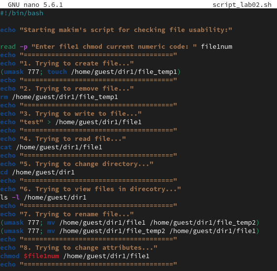

:::
::::::::::::::

## Bash-скрипт. Выполнение. 1

:::::::::::::: {.columns align=top}
::: {.column width="25%"}

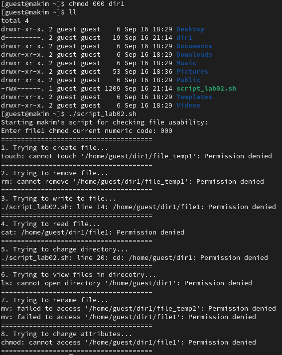

:::
::: {.column width="25%"}

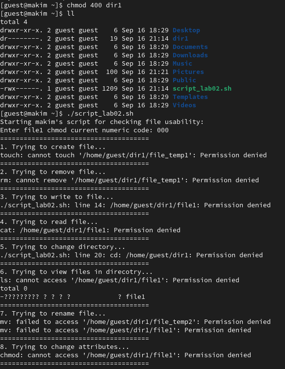

:::
::: {.column width="25%"}

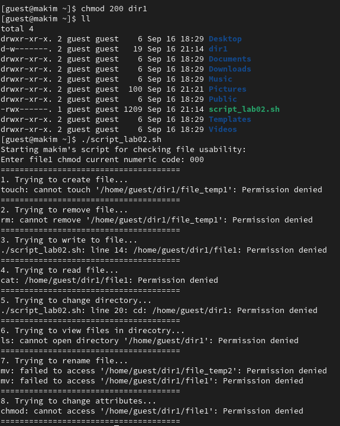

:::
::: {.column width="25%"}

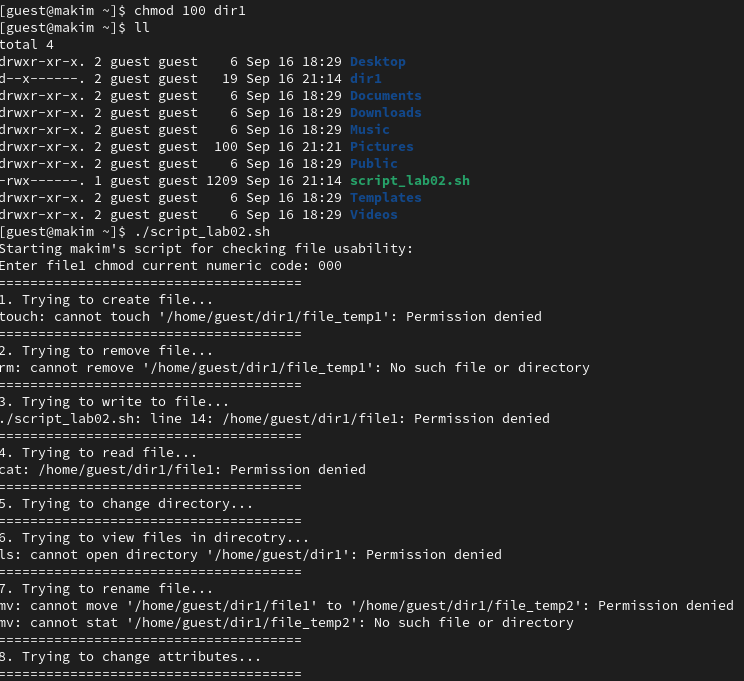

:::
::::::::::::::

## Bash-скрипт. Выполнение. 2

:::::::::::::: {.columns align=top}
::: {.column width="25%"}

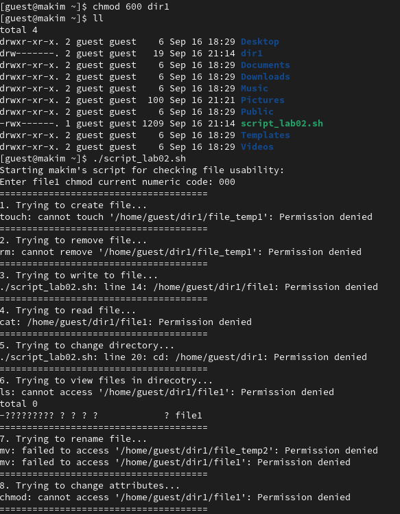

:::
::: {.column width="25%"}

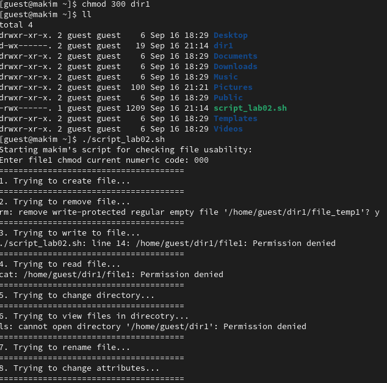

:::
::: {.column width="25%"}

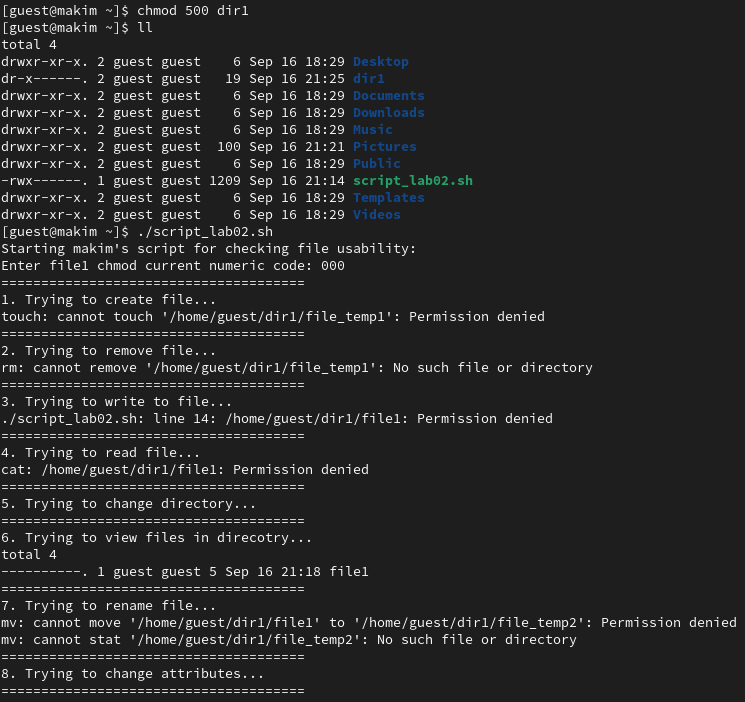

:::
::: {.column width="25%"}

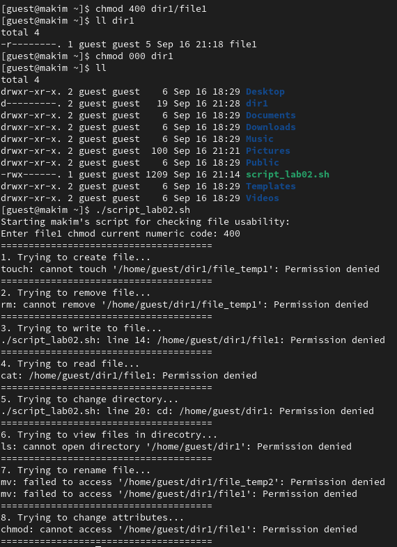

:::
::::::::::::::

## Результирующая таблица 1.

|Права д.|Права ф.|Создание ф.|Удаление ф.|Запись в ф.|Чтение ф.|Смена д.|Просмотр ф. в д.|Переименов. ф.|Смена атр. ф.|
| --- | --- | --- | --- | --- | --- | --- | --- | --- | --- | 
|d--------- (000)|--------- (000)|-|-|-|-|-|-|-|-|
|d--------- (000)|--x------ (100)|-|-|-|-|-|-|-|-|
|d--------- (000)|-w------- (200)|-|-|-|-|-|-|-|-|
|d--------- (000)|-wx------ (300)|-|-|-|-|-|-|-|-|
|d--------- (000)|r-------- (400)|-|-|-|-|-|-|-|-|
|d--------- (000)|r-x------ (500)|-|-|-|-|-|-|-|-|
|d--------- (000)|rw------- (600)|-|-|-|-|-|-|-|-|
|d--------- (000)|rwx------ (700)|-|-|-|-|-|-|-|-|
|d--x------ (100)|--------- (000)|-|-|-|-|+|-|-|+|
|d--x------ (100)|--x------ (100)|-|-|-|-|+|-|-|+|
|d--x------ (100)|-w------- (200)|-|-|+|-|+|-|-|+|
|d--x------ (100)|-wx------ (300)|-|-|+|-|+|-|-|+|
|d--x------ (100)|r-------- (400)|-|-|-|+|+|-|-|+|
|d--x------ (100)|r-x------ (500)|-|-|-|+|+|-|-|+|
|d--x------ (100)|rw------- (600)|-|-|+|+|+|-|-|+|
|d--x------ (100)|rwx------ (700)|-|-|+|+|+|-|-|+|
|d-w------- (200)|--------- (000)|-|-|-|-|-|-|-|-|
|d-w------- (200)|--x------ (100)|-|-|-|-|-|-|-|-|
|d-w------- (200)|-w------- (200)|-|-|-|-|-|-|-|-|
|d-w------- (200)|-wx------ (300)|-|-|-|-|-|-|-|-|
|d-w------- (200)|r-------- (400)|-|-|-|-|-|-|-|-|
|d-w------- (200)|r-x------ (500)|-|-|-|-|-|-|-|-|
|d-w------- (200)|rw------- (600)|-|-|-|-|-|-|-|-|
|d-w------- (200)|rwx------ (700)|-|-|-|-|-|-|-|-|
|d-wx------ (300)|--------- (000)|+|+|-|-|+|-|+|+|
|d-wx------ (300)|--x------ (100)|+|+|-|-|+|-|+|+|
|d-wx------ (300)|-w------- (200)|+|+|+|-|+|-|+|+|
|d-wx------ (300)|-wx------ (300)|+|+|+|-|+|-|+|+|
|d-wx------ (300)|r-------- (400)|+|+|-|+|+|-|+|+|
|d-wx------ (300)|r-x------ (500)|+|+|-|+|+|-|+|+|
|d-wx------ (300)|rw------- (600)|+|+|+|+|+|-|+|+|
|d-wx------ (300)|rwx------ (700)|+|+|+|+|+|-|+|+|
|dr-------- (400)|--------- (000)|-|-|-|-|-|+|-|-|
|dr-------- (400)|--x------ (100)|-|-|-|-|-|+|-|-|
|dr-------- (400)|-w------- (200)|-|-|-|-|-|+|-|-|
|dr-------- (400)|-wx------ (300)|-|-|-|-|-|+|-|-|
|dr-------- (400)|r-------- (400)|-|-|-|-|-|+|-|-|
|dr-------- (400)|r-x------ (500)|-|-|-|-|-|+|-|-|
|dr-------- (400)|rw------- (600)|-|-|-|-|-|+|-|-|
|dr-------- (400)|rwx------ (700)|-|-|-|-|-|+|-|-|
|dr-x------ (500)|--------- (000)|-|-|-|-|+|+|-|+|
|dr-x------ (500)|--x------ (100)|-|-|-|-|+|+|-|+|
|dr-x------ (500)|-w------- (200)|-|-|+|-|+|+|-|+|
|dr-x------ (500)|-wx------ (300)|-|-|+|-|+|+|-|+|
|dr-x------ (500)|r-------- (400)|-|-|-|+|+|+|-|+|
|dr-x------ (500)|r-x------ (500)|-|-|-|+|+|+|-|+|
|dr-x------ (500)|rw------- (600)|-|-|+|+|+|+|-|+|
|dr-x------ (500)|rwx------ (700)|-|-|+|+|+|+|-|+|
|drw------- (600)|--------- (000)|-|-|-|-|-|+|-|-|
|drw------- (600)|--x------ (100)|-|-|-|-|-|+|-|-|
|drw------- (600)|-w------- (200)|-|-|-|-|-|+|-|-|
|drw------- (600)|-wx------ (300)|-|-|-|-|-|+|-|-|
|drw------- (600)|r-------- (400)|-|-|-|-|-|+|-|-|
|drw------- (600)|r-x------ (500)|-|-|-|-|-|+|-|-|
|drw------- (600)|rw------- (600)|-|-|-|-|-|+|-|-|
|drw------- (600)|rwx------ (700)|-|-|-|-|-|+|-|-|
|drwx------ (700)|--------- (000)|+|+|-|-|+|+|+|+|
|drwx------ (700)|--x------ (100)|+|+|-|-|+|+|+|+|
|drwx------ (700)|-w------- (200)|+|+|+|-|+|+|+|+|
|drwx------ (700)|-wx------ (300)|+|+|+|-|+|+|+|+|
|drwx------ (700)|r-------- (400)|+|+|-|+|+|+|+|+|
|drwx------ (700)|r-x------ (500)|+|+|-|+|+|+|+|+|
|drwx------ (700)|rw------- (600)|+|+|+|+|+|+|+|+|
|drwx------ (700)|rwx------ (700)|+|+|+|+|+|+|+|+|

## Результирующая таблица 2.

|Операция|Мин. права на д.|Мин. права на ф.|
| --- | --- | --- |
|Создание файла|d-wx------ (300)|--------- (000)|
|Удаление файла|d-wx------ (300)|--------- (000)|
|Чтение файла|d--x------ (100)|r-------- (400)|
|Запись в файл|d--x------ (100)|-w------- (200)|
|Переименование файла|d-wx------ (300)|--------- (000)|
|Создание поддиректории|d-wx------ (300)|--------- (000)|
|Удаление поддиректории|d-wx------ (300)|--------- (000)|

# Результаты

- Выполнены все необходимые действия.

## Вывод

Получил практические навыки работы в консоли с атрибутами файлов, закрепил теоретические основы дискреционного разграничения доступа в современных системах с открытым кодом на базе ОС Linux.