---
## Front matter
title: "Отчет по лабораторной работе №2"
subtitle: "по дисциплине: Информационная безопасность"
author: "Ким Михаил Алексеевич"

## Generic otions
lang: ru-RU
toc-title: "Содержание"

## Bibliography
bibliography: bib/cite.bib
csl: pandoc/csl/gost-r-7-0-5-2008-numeric.csl

## Pdf output format
toc: true # Table of contents
toc-depth: 2
lof: true # List of figures
lot: false # List of tables
fontsize: 12pt
linestretch: 1.5
papersize: a4
documentclass: scrreprt
## I18n polyglossia
polyglossia-lang:
  name: russian
  options:
	- spelling=modern
	- babelshorthands=true
polyglossia-otherlangs:
  name: english
## I18n babel
babel-lang: russian
babel-otherlangs: english
## Fonts
mainfont: PT Serif
romanfont: PT Serif
sansfont: PT Sans
monofont: PT Mono
mainfontoptions: Ligatures=TeX
romanfontoptions: Ligatures=TeX
sansfontoptions: Ligatures=TeX,Scale=MatchLowercase
monofontoptions: Scale=MatchLowercase,Scale=0.9
## Biblatex
biblatex: true
biblio-style: "gost-numeric"
biblatexoptions:
  - parentracker=true
  - backend=biber
  - hyperref=auto
  - language=auto
  - autolang=other*
  - citestyle=gost-numeric
## Pandoc-crossref LaTeX customization
figureTitle: "Рис."
tableTitle: "Таблица"
listingTitle: "Листинг"
lofTitle: "Список иллюстраций"
lotTitle: "Список таблиц"
lolTitle: "Листинги"
## Misc options
indent: true
header-includes:
  - \usepackage{indentfirst}
  - \usepackage{float} # keep figures where there are in the text
  - \floatplacement{figure}{H} # keep figures where there are in the text
---

# Цель работы

Получение практических навыков работы в консоли с атрибутами файлов, закрепление теоретических основ дискреционного разграничения доступа в современных системах с открытым кодом на базе ОС Linux.

# Задание

1. Создать, настроить пользователя guest и изучить информацию о пользователе.

2. Создать и изучить дериктории, провести эксперименты с правами доступа.

3. Заполнить таблицы "Установленные права и разрешённые действия" и "Минимальные права для совершения операций".

# Теоретическое введение
## Термины

- Терминал (или «Bash», сокращение от «Bourne-Again shell») — это программа, которая используется для взаимодействия с командной оболочкой. Терминал применяется для выполнения административных задач, например: установку пакетов, действия с файлами и управление пользователями. [@terminal]

- Права доступа определяют, какие действия конкретный пользователь может или не может совершать с определенным файлами и каталогами. [@mode]

# Выполнение лабораторной работы
## Выполнение заданий

1. В установленной при выполнении предыдущей лабораторной работы операционной системе создадим учётную запись пользователя guest (используя учётную запись администратора). Зададим пароль для пользователя guest (рис. @fig:01):

    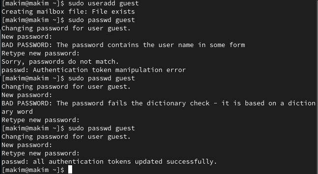{#fig:01 width=86%}

3. Войдем в систему от имени пользователя guest. Определим директорию, в которой находимся, командой `pwd`. Сравним её с приглашением командной строки: они совпадают. Определим, является ли он домашней директорией: да, является. Уточним имя вашего пользователя командой `whoami`. Уточним имя пользователя, его группу, а также группы, куда входит пользователь, командой `id`. Сравним вывод `id` с выводом команды groups: `id` выводит информации о пользователе, группе. `groups` выводит только имя группы. Сравним полученную информацию об имени пользователя с данными, выводимыми в приглашении командной строки: они совпадают (рис. @fig:02).

    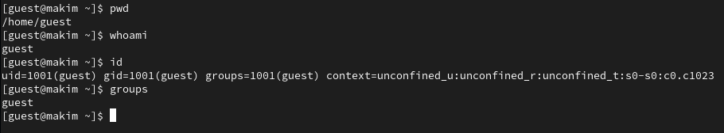{#fig:02 width=86%}

4. Просмотрим файл /etc/passwd командой `cat /etc/passwd`. Найдем в нём свою учётную запись.  Определим uid пользователя (1001). Определите gid пользователя (1001). Сравним найденные значения с полученными в предыдущих пунктах: они совпадают (рис. @fig:03).

    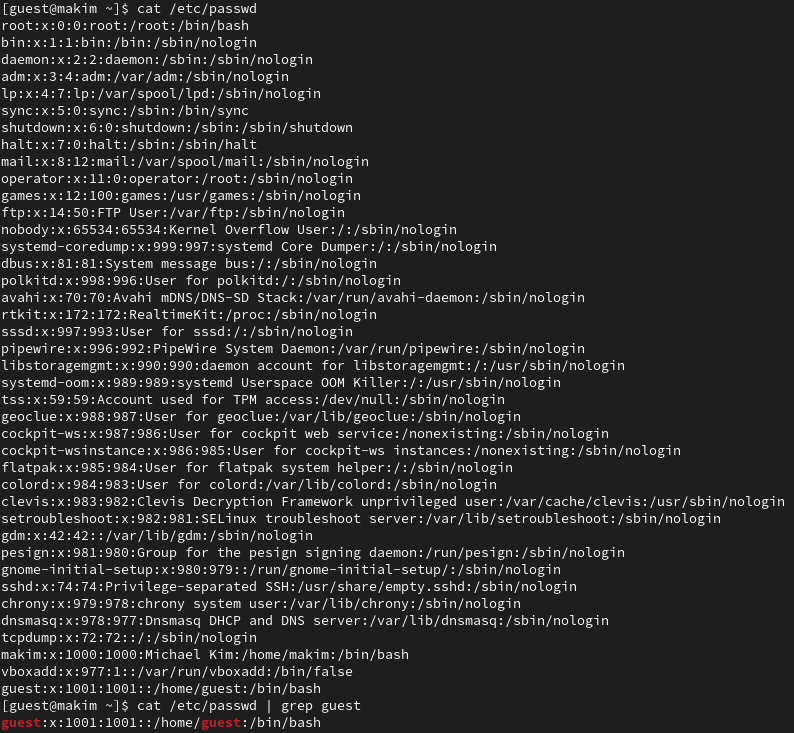{#fig:03 width=86%}

5. Определим существующие в системе директории командой `ls -l /home/`. Получаем все директории, находящиеся в /home. У них установлены права на чтение, запись и исполнение для пользователя. Проверим, какие расширенные атрибуты установлены на поддиректориях, находящихся в директории /home, командой:
`lsattr /home`. Расширенные атрибуты удалось увидеть только у текущего пользователя терминала (рис. @fig:04).

    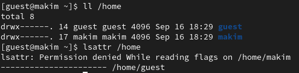{#fig:04 width=86%}

6. Создадим в домашней директории поддиректорию dir1. Определим командами, какие права доступа и расширенные атрибуты были выставлены на директорию dir1 (рис. @fig:05).

    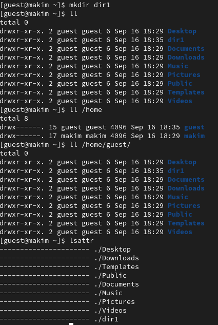{#fig:05 width=86%}

7. Снимем с директории dir1 все атрибуты и проверим с её помощью правильность выполнения команды `ls -l`. Попытайтемся создать в директории dir1 файл file1 командой `echo "test" > /home/guest/dir1/file1`. Мы не можем это сделать, т.к. у пользователя не хватает прав на создание файла. Файл не создастся (рис. @fig:06, @fig:07).

    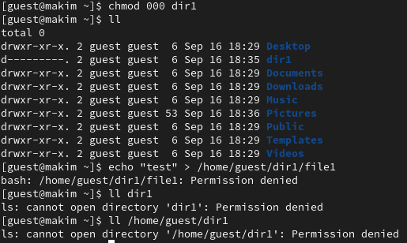{#fig:06 width=86%}

    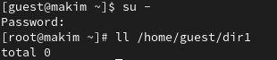{#fig:07 width=86%}

## Заполнение таблиц

1. Заполним таблицу «Установленные права и разрешённые действия», выполняя действия от имени владельца директории (файлов), определив опытным путём, какие операции разрешены, а какие нет. Если операция разрешена, занесем в таблицу знак «+», если не разрешена, знак «-». Для данных целей написал небольшой скрипт, чтобы не писать множество одинаковых команд вручную (рис. @fig:09). При помощи скрипта будем вносить значения в таблицу (рис. @fig:10, @fig:11, @fig:12, @fig:13, @fig:14, @fig:15, @fig:16, @fig:17).

    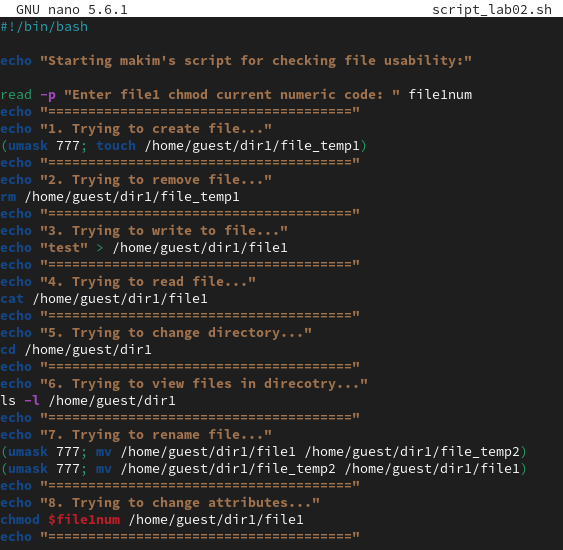{#fig:09 width=86%}

    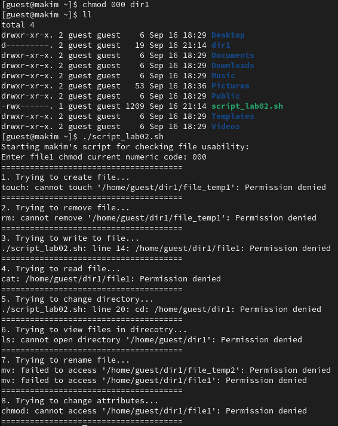{#fig:10 width=86%}

    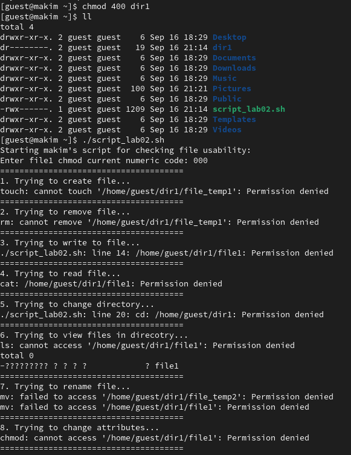{#fig:11 width=86%}

    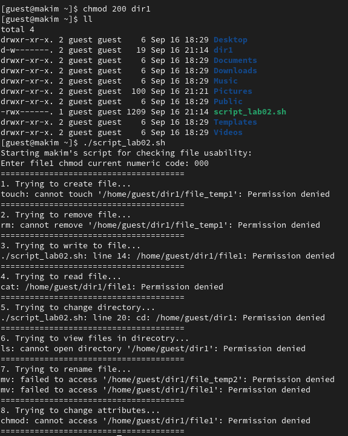{#fig:12 width=86%}

    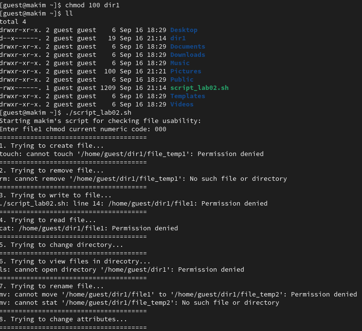{#fig:13 width=86%}

    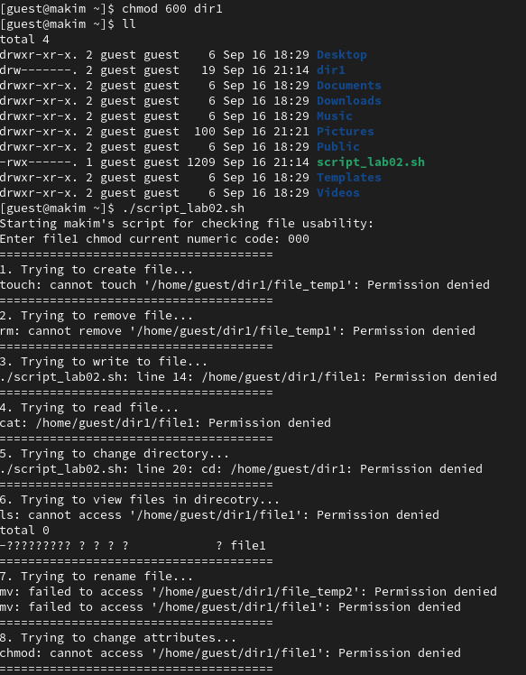{#fig:14 width=86%}

    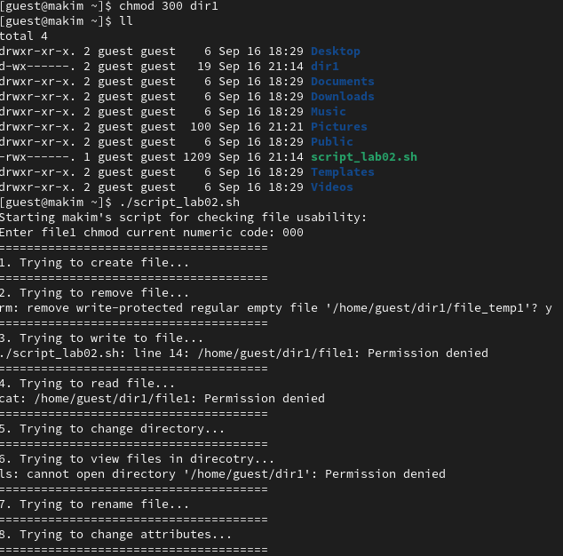{#fig:15 width=86%}

    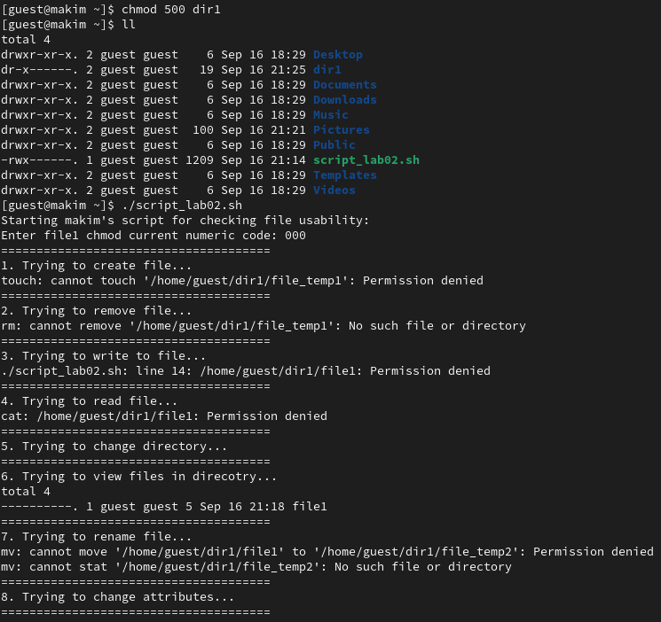{#fig:16 width=86%}

    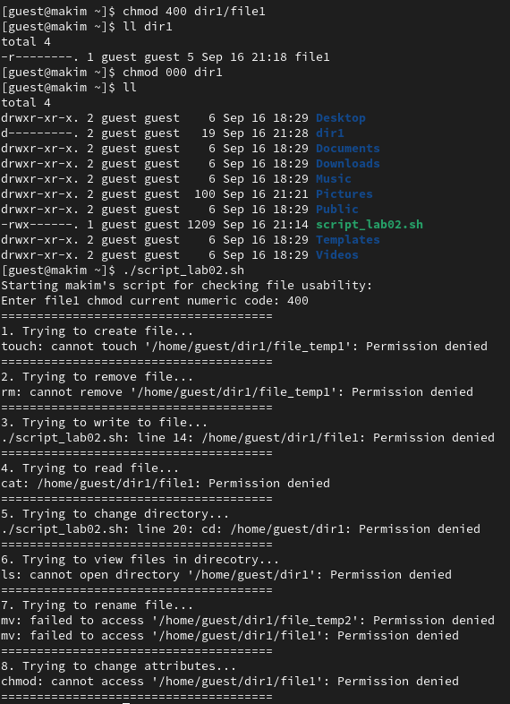{#fig:17 width=86%}

|Права директории|Права файла|Создание файла|Удаление файла|Запись в файл|Чтение файла|Смена директории|Просмотр файлов в директории|Переименование файла|Смена атрибутов файла|
| --- | --- | --- | --- | --- | --- | --- | --- | --- | --- | 
|d--------- (000)|--------- (000)|-|-|-|-|-|-|-|-|
|d--------- (000)|--x------ (100)|-|-|-|-|-|-|-|-|
|d--------- (000)|-w------- (200)|-|-|-|-|-|-|-|-|
|d--------- (000)|-wx------ (300)|-|-|-|-|-|-|-|-|
|d--------- (000)|r-------- (400)|-|-|-|-|-|-|-|-|
|d--------- (000)|r-x------ (500)|-|-|-|-|-|-|-|-|
|d--------- (000)|rw------- (600)|-|-|-|-|-|-|-|-|
|d--------- (000)|rwx------ (700)|-|-|-|-|-|-|-|-|
|d--x------ (100)|--------- (000)|-|-|-|-|+|-|-|+|
|d--x------ (100)|--x------ (100)|-|-|-|-|+|-|-|+|
|d--x------ (100)|-w------- (200)|-|-|+|-|+|-|-|+|
|d--x------ (100)|-wx------ (300)|-|-|+|-|+|-|-|+|
|d--x------ (100)|r-------- (400)|-|-|-|+|+|-|-|+|
|d--x------ (100)|r-x------ (500)|-|-|-|+|+|-|-|+|
|d--x------ (100)|rw------- (600)|-|-|+|+|+|-|-|+|
|d--x------ (100)|rwx------ (700)|-|-|+|+|+|-|-|+|
|d-w------- (200)|--------- (000)|-|-|-|-|-|-|-|-|
|d-w------- (200)|--x------ (100)|-|-|-|-|-|-|-|-|
|d-w------- (200)|-w------- (200)|-|-|-|-|-|-|-|-|
|d-w------- (200)|-wx------ (300)|-|-|-|-|-|-|-|-|
|d-w------- (200)|r-------- (400)|-|-|-|-|-|-|-|-|
|d-w------- (200)|r-x------ (500)|-|-|-|-|-|-|-|-|
|d-w------- (200)|rw------- (600)|-|-|-|-|-|-|-|-|
|d-w------- (200)|rwx------ (700)|-|-|-|-|-|-|-|-|
|d-wx------ (300)|--------- (000)|+|+|-|-|+|-|+|+|
|d-wx------ (300)|--x------ (100)|+|+|-|-|+|-|+|+|
|d-wx------ (300)|-w------- (200)|+|+|+|-|+|-|+|+|
|d-wx------ (300)|-wx------ (300)|+|+|+|-|+|-|+|+|
|d-wx------ (300)|r-------- (400)|+|+|-|+|+|-|+|+|
|d-wx------ (300)|r-x------ (500)|+|+|-|+|+|-|+|+|
|d-wx------ (300)|rw------- (600)|+|+|+|+|+|-|+|+|
|d-wx------ (300)|rwx------ (700)|+|+|+|+|+|-|+|+|
|dr-------- (400)|--------- (000)|-|-|-|-|-|+|-|-|
|dr-------- (400)|--x------ (100)|-|-|-|-|-|+|-|-|
|dr-------- (400)|-w------- (200)|-|-|-|-|-|+|-|-|
|dr-------- (400)|-wx------ (300)|-|-|-|-|-|+|-|-|
|dr-------- (400)|r-------- (400)|-|-|-|-|-|+|-|-|
|dr-------- (400)|r-x------ (500)|-|-|-|-|-|+|-|-|
|dr-------- (400)|rw------- (600)|-|-|-|-|-|+|-|-|
|dr-------- (400)|rwx------ (700)|-|-|-|-|-|+|-|-|
|dr-x------ (500)|--------- (000)|-|-|-|-|+|+|-|+|
|dr-x------ (500)|--x------ (100)|-|-|-|-|+|+|-|+|
|dr-x------ (500)|-w------- (200)|-|-|+|-|+|+|-|+|
|dr-x------ (500)|-wx------ (300)|-|-|+|-|+|+|-|+|
|dr-x------ (500)|r-------- (400)|-|-|-|+|+|+|-|+|
|dr-x------ (500)|r-x------ (500)|-|-|-|+|+|+|-|+|
|dr-x------ (500)|rw------- (600)|-|-|+|+|+|+|-|+|
|dr-x------ (500)|rwx------ (700)|-|-|+|+|+|+|-|+|
|drw------- (600)|--------- (000)|-|-|-|-|-|+|-|-|
|drw------- (600)|--x------ (100)|-|-|-|-|-|+|-|-|
|drw------- (600)|-w------- (200)|-|-|-|-|-|+|-|-|
|drw------- (600)|-wx------ (300)|-|-|-|-|-|+|-|-|
|drw------- (600)|r-------- (400)|-|-|-|-|-|+|-|-|
|drw------- (600)|r-x------ (500)|-|-|-|-|-|+|-|-|
|drw------- (600)|rw------- (600)|-|-|-|-|-|+|-|-|
|drw------- (600)|rwx------ (700)|-|-|-|-|-|+|-|-|
|drwx------ (700)|--------- (000)|+|+|-|-|+|+|+|+|
|drwx------ (700)|--x------ (100)|+|+|-|-|+|+|+|+|
|drwx------ (700)|-w------- (200)|+|+|+|-|+|+|+|+|
|drwx------ (700)|-wx------ (300)|+|+|+|-|+|+|+|+|
|drwx------ (700)|r-------- (400)|+|+|-|+|+|+|+|+|
|drwx------ (700)|r-x------ (500)|+|+|-|+|+|+|+|+|
|drwx------ (700)|rw------- (600)|+|+|+|+|+|+|+|+|
|drwx------ (700)|rwx------ (700)|+|+|+|+|+|+|+|+|

2. На основании предыдущей таблицы заполним следующую таблицу.

|Операция|Минимальные права на директорию|Минимальные права на файл|
| --- | --- | --- |
|Создание файла|d-wx------ (300)|--------- (000)|
|Удаление файла|d-wx------ (300)|--------- (000)|
|Чтение файла|d--x------ (100)|r-------- (400)|
|Запись в файл|d--x------ (100)|-w------- (200)|
|Переименование файла|d-wx------ (300)|--------- (000)|
|Создание поддиректории|d-wx------ (300)|--------- (000)|
|Удаление поддиректории|d-wx------ (300)|--------- (000)|

# Анализ результатов

Работа выполнена без каких-либо проблем. Работа с терминалом ОС Rocky Linux в данном случае нареканий не вызвала. Также порадовало наличие вкладок в терминале «из коробки».

# Выводы

Получил практические навыки работы в консоли с атрибутами файлов, закрепил теоретические основы дискреционного разграничения доступа в современных системах с открытым кодом на базе ОС Linux.

# Список литературы{.unnumbered}

::: {#refs}
:::
