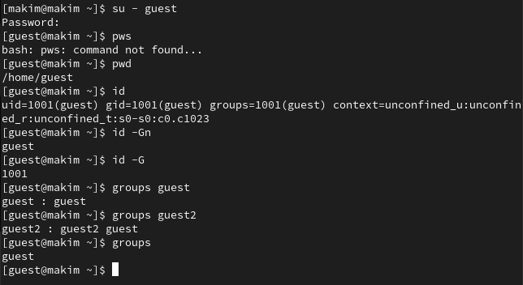
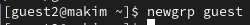
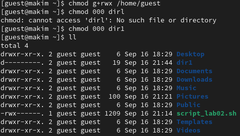
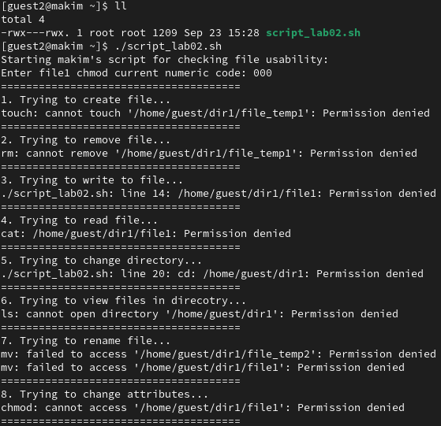
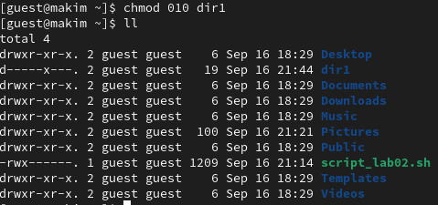
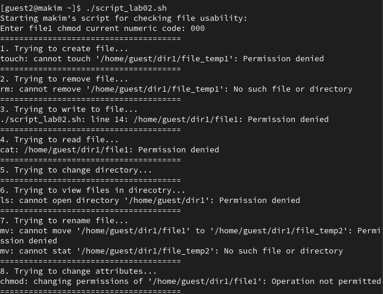

---
## Front matter
title: "Отчет по лабораторной работе №3"
subtitle: "по дисциплине: Информационная безопасность"
author: "Ким Михаил Алексеевич"

## Generic otions
lang: ru-RU
toc-title: "Содержание"

## Bibliography
bibliography: bib/cite.bib
csl: pandoc/csl/gost-r-7-0-5-2008-numeric.csl

## Pdf output format
toc: true # Table of contents
toc-depth: 2
lof: true # List of figures
lot: false # List of tables
fontsize: 12pt
linestretch: 1.5
papersize: a4
documentclass: scrreprt
## I18n polyglossia
polyglossia-lang:
  name: russian
  options:
	- spelling=modern
	- babelshorthands=true
polyglossia-otherlangs:
  name: english
## I18n babel
babel-lang: russian
babel-otherlangs: english
## Fonts
mainfont: PT Serif
romanfont: PT Serif
sansfont: PT Sans
monofont: PT Mono
mainfontoptions: Ligatures=TeX
romanfontoptions: Ligatures=TeX
sansfontoptions: Ligatures=TeX,Scale=MatchLowercase
monofontoptions: Scale=MatchLowercase,Scale=0.9
## Biblatex
biblatex: true
biblio-style: "gost-numeric"
biblatexoptions:
  - parentracker=true
  - backend=biber
  - hyperref=auto
  - language=auto
  - autolang=other*
  - citestyle=gost-numeric
## Pandoc-crossref LaTeX customization
figureTitle: "Рис."
tableTitle: "Таблица"
listingTitle: "Листинг"
lofTitle: "Список иллюстраций"
lotTitle: "Список таблиц"
lolTitle: "Листинги"
## Misc options
indent: true
header-includes:
  - \usepackage{indentfirst}
  - \usepackage{float} # keep figures where there are in the text
  - \floatplacement{figure}{H} # keep figures where there are in the text
---

# Цель работы

Получение практических навыков работы в консоли с атрибутами файлов для групп пользователей.

# Задание

1. Создать, настроить пользователей guest и guest2, а также изучить информацию о них.

2. Произвести эксперименты с правами доступа для пользователей в группе.

3. Заполнить таблицы «Установленные права и разрешённые действия для групп» и «Минимальные права для совершения операций от имени пользователей входящих в группу».

# Теоретическое введение
## Термины

- Терминал (или «Bash», сокращение от «Bourne-Again shell») — это программа, которая используется для взаимодействия с командной оболочкой. Терминал применяется для выполнения административных задач, например: установку пакетов, действия с файлами и управление пользователями. [@terminal]

- Права доступа определяют, какие действия конкретный пользователь может или не может совершать с определенным файлами и каталогами. [@mode]

- У каждого файла/директории есть 3 группы пользователей, для которых можно устанавливать права доступа:
  
  - owner (владелец) — отдельный человек, который владеет файлом. Обычно это тот, кто создал файл, но владельцем можно сделать и кого-то другого.
  - group (группа) — пользователи с общими заданными правами.
  - others (другие) — все остальные пользователи, не относящиеся к группе и не являющиеся владельцами. [@mode-groups]

# Выполнение лабораторной работы
## Выполнение заданий

1. В установленной при выполнении предыдущей лабораторной работы операционной системе создадим учётную запись второго пользователя `guest2`. Зададим пароль для него пароль (рис. @fig:01):

    {#fig:01 width=86%}

2. Осуществим вход в систему от двух пользователей на двух разных консолях. Для обоих пользователей командой `pwd` определим директорию, в которой находимся. Сравним её с приглашениями командной строки: они совпадают (знак `~` обозначает домашнюю директорию). Уточним имя пользователя, его группу, кто входит в неё и к каким группам принадлежит он сам. Определим командами
`groups guest` и `groups guest2`, в какие группы входят пользователи `guest` и `guest2`. Сравним вывод команды `groups` с выводом команд `id -Gn` и `id -G`: они совпадают (рис. @fig:02, @fig:03).

    {#fig:02 width=86%}

    {#fig:03 width=86%}

3. Сравним полученную информацию с содержимым файла `/etc/group`: информация совпадает (рис. @fig:04).

    {#fig:04 width=86%}

4. От имени пользователя guest2 выполним регистрацию пользователя guest2 в группе guest командой `newgrp guest` (рис. @fig:45).

    {#fig:45 width=86%}

5. От имени пользователя guest изменим права директории /home/guest, разрешив все действия для пользователей группы: `chmod g+rwx /home/guest`. От имени пользователя guest снимим с директории /home/guest/dir1 все атрибуты командой `chmod 000 dir1` и проверим правильность снятия атрибутов (рис. @fig:05).

    {#fig:05 width=86%}

## Заполнение таблиц

1. Заполним таблицу «Установленные права и разрешённые действия для групп». Для данных целей использовую тот же собственноручно написанный скрипт, что и в предыдущей лабораторной работу. Необходимо это, чтобы не писать множество одинаковых команд вручную. При помощи скрипта будем вносить значения в таблицу (рис. @fig:55, @fig:06, @fig:07, @fig:08, @fig:09).

    {#fig:55 width=86%}

    {#fig:06 width=86%}

    {#fig:07 width=86%}

    {#fig:08 width=86%}

    {#fig:09 width=86%}

2. В итоге получаем таблицу.

| Права директории | Права файла | Создание файла | Удаление файла | Запись в файл | Чтение файла | Смена директории | Просмотр файлов в директории | Переименование файла | Смена атрибутов файла |
|---|---|---|---|---|---|---|---|---|---|
| d--------- (000) | ---------- (000) | - | - | - | - | - | - | - | - |
| d-----x--- (010) | ---------- (000) | - | - | - | - | + | - | - | + |
| d----w---- (020) | ---------- (000) | - | - | - | - | - | - | - | - |
| d----wx--- (030) | ---------- (000) | + | + | - | - | + | - | + | + |
| d---r----- (040) | ---------- (000) | - | - | - | - | - | + | - | - |
| d---r-x--- (050) | ---------- (000) | - | - | - | - | + | + | - | + |
| d---rw---- (060) | ---------- (000) | - | - | - | - | - | + | - | - |
| d---rwx--- (070) | ---------- (000) | + | + | - | - | + | + | + | + |
| d--------- (000) | ------x--- (010) | - | - | - | - | - | - | - | - |
| d-----x--- (010) | ------x--- (010) | - | - | - | - | + | - | - | + |
| d----w---- (020) | ------x--- (010) | - | - | - | - | - | - | - | - |
| d----wx--- (030) | ------x--- (010) | + | + | - | - | + | - | + | + |
| d---r----- (040) | ------x--- (010) | - | - | - | - | - | + | - | - |
| d---r-x--- (050) | ------x--- (010) | - | - | - | - | + | + | - | + |
| d---rw---- (060) | ------x--- (010) | - | - | - | - | - | + | - | - |
| d---rwx--- (070) | ------x--- (010) | + | + | - | - | + | + | + | + |
| d--------- (000) | -----w---- (020) | - | - | - | - | - | - | - | - |
| d-----x--- (010) | -----w---- (020) | - | - | + | - | + | - | - | + |
| d----w---- (020) | -----w---- (020) | - | - | - | - | - | - | - | - |
| d----wx--- (030) | -----w---- (020) | + | + | + | - | + | - | + | + |
| d---r----- (040) | -----w---- (020) | - | - | - | - | - | + | - | - |
| d---r-x--- (050) | -----w---- (020) | - | - | + | - | + | + | - | + |
| d---rw---- (060) | -----w---- (020) | - | - | - | - | - | + | - | - |
| d---rwx--- (070) | -----w---- (020) | + | + | + | - | + | + | + | + |
| d--------- (000) | -----wx--- (030) | - | - | - | - | - | - | - | - |
| d-----x--- (010) | -----wx--- (030) | - | - | + | - | + | - | - | + |
| d----w---- (020) | -----wx--- (030) | - | - | - | - | - | - | - | - |
| d----wx--- (030) | -----wx--- (030) | + | + | + | - | + | - | + | + |
| d---r----- (040) | -----wx--- (030) | - | - | - | - | - | + | - | - |
| d---r-x--- (050) | -----wx--- (030) | - | - | + | - | + | + | - | + |
| d---rw---- (060) | -----wx--- (030) | - | - | - | - | - | + | - | - |
| d---rwx--- (070) | -----wx--- (030) | + | + | + | - | + | + | + | + |
| d--------- (000) | ----r----- (040) | - | - | - | - | - | - | - | - |
| d-----x--- (010) | ----r----- (040) | - | - | - | + | + | - | - | + |
| d----w---- (020) | ----r----- (040) | - | - | - | - | - | - | - | - |
| d----wx--- (030) | ----r----- (040) | + | + | - | + | + | - | + | + |
| d---r----- (040) | ----r----- (040) | - | - | - | - | - | + | - | - |
| d---r-x--- (050) | ----r----- (040) | - | - | - | + | + | + | - | + |
| d---rw---- (060) | ----r----- (040) | - | - | - | - | - | + | - | - |
| d---rwx--- (070) | ----r----- (040) | + | + | - | + | + | + | + | + |
| d--------- (000) | ----r-x--- (050) | - | - | - | - | - | - | - | - |
| d-----x--- (010) | ----r-x--- (050) | - | - | - | + | + | - | - | + |
| d----w---- (020) | ----r-x--- (050) | - | - | - | - | - | - | - | - |
| d----wx--- (030) | ----r-x--- (050) | + | + | - | + | + | - | + | + |
| d---r----- (040) | ----r-x--- (050) | - | - | - | - | - | + | - | - |
| d---r-x--- (050) | ----r-x--- (050) | - | - | - | + | + | + | - | + |
| d---rw---- (060) | ----r-x--- (050) | - | - | - | - | - | + | - | - |
| d---rwx--- (070) | ----r-x--- (050) | + | + | - | + | + | + | + | + |
| d--------- (000) | ----rw---- (060) | - | - | - | - | - | - | - | - |
| d-----x--- (010) | ----rw---- (060) | - | - | + | + | + | - | - | + |
| d----w---- (020) | ----rw---- (060) | - | - | - | - | - | - | - | - |
| d----wx--- (030) | ----rw---- (060) | + | + | + | + | + | - | + | + |
| d---r----- (040) | ----rw---- (060) | - | - | - | - | - | + | - | - |
| d---r-x--- (050) | ----rw---- (060) | - | - | + | + | + | + | - | + |
| d---rw---- (060) | ----rw---- (060) | - | - | - | - | - | + | - | - |
| d---rwx--- (070) | ----rw---- (060) | + | + | + | + | + | + | + | + |
| d--------- (000) | ----rwx--- (070) | - | - | - | - | - | - | - | - |
| d-----x--- (010) | ----rwx--- (070) | - | - | + | + | + | - | - | + |
| d----w---- (020) | ----rwx--- (070) | - | - | - | - | - | - | - | - |
| d----wx--- (030) | ----rwx--- (070) | + | + | + | + | + | - | + | + |
| d---r----- (040) | ----rwx--- (070) | - | - | - | - | - | + | - | - |
| d---r-x--- (050) | ----rwx--- (070) | - | - | + | + | + | + | - | + |
| d---rw---- (060) | ----rwx--- (070) | - | - | - | - | - | + | - | - |
| d---rwx--- (070) | ----rwx--- (070) | + | + | + | + | + | + | + | + |

3. На основании предыдущей таблицы заполним таблицу «Минимальные права для совершения операций от имени пользователей входящих в группу».

| Операция               | Минимальные права на директорию | Минимальные права на файл |
|------------------------|---------------------------------|---------------------------|
| Создание файла         | d----wx--- (030)                | ---------- (000)          |
| Удаление файла         | d----wx--- (030)                | ---------- (000)          |
| Чтение файла           | d-----x--- (010)                | ----r----- (040)          |
| Запись в файл          | d-----x--- (010)                | -----w---- (020)          |
| Переименование файла   | d----wx--- (030)                | ---------- (000)          |
| Создание поддиректории | d----wx--- (030)                | ---------- (000)          |
| Удаление поддиректории | d----wx--- (030)                | ---------- (000)          |

# Анализ результатов

Работа выполнена без каких-либо проблем. Работа с терминалом ОС Rocky Linux в данном случае нареканий не вызвала. Также порадовало наличие вкладок в терминале «из коробки».

# Выводы

Получил практических навыков работы в консоли с атрибутами файлов для групп пользователей.

# Список литературы{.unnumbered}

::: {#refs}
:::
