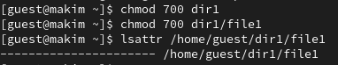
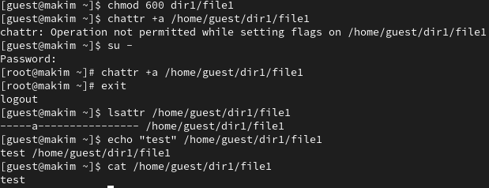
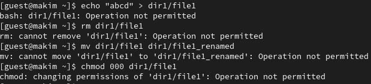
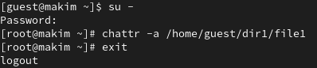
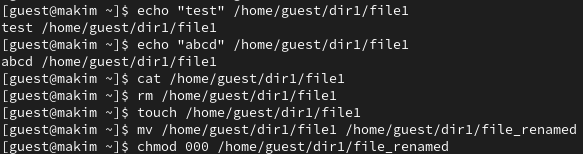
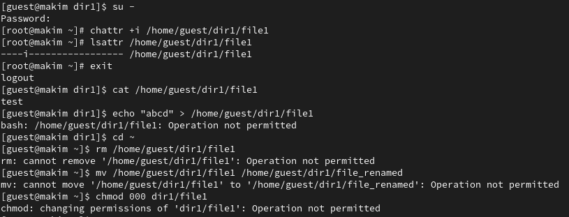

---
## Front matter
title: "Отчет по лабораторной работе №4"
subtitle: "по дисциплине: Информационная безопасность"
author: "Ким Михаил Алексеевич"

## Generic otions
lang: ru-RU
toc-title: "Содержание"

## Bibliography
bibliography: bib/cite.bib
csl: pandoc/csl/gost-r-7-0-5-2008-numeric.csl

## Pdf output format
toc: true # Table of contents
toc-depth: 2
lof: true # List of figures
lot: false # List of tables
fontsize: 12pt
linestretch: 1.5
papersize: a4
documentclass: scrreprt
## I18n polyglossia
polyglossia-lang:
  name: russian
  options:
	- spelling=modern
	- babelshorthands=true
polyglossia-otherlangs:
  name: english
## I18n babel
babel-lang: russian
babel-otherlangs: english
## Fonts
mainfont: PT Serif
romanfont: PT Serif
sansfont: PT Sans
monofont: PT Mono
mainfontoptions: Ligatures=TeX
romanfontoptions: Ligatures=TeX
sansfontoptions: Ligatures=TeX,Scale=MatchLowercase
monofontoptions: Scale=MatchLowercase,Scale=0.9
## Biblatex
biblatex: true
biblio-style: "gost-numeric"
biblatexoptions:
  - parentracker=true
  - backend=biber
  - hyperref=auto
  - language=auto
  - autolang=other*
  - citestyle=gost-numeric
## Pandoc-crossref LaTeX customization
figureTitle: "Рис."
tableTitle: "Таблица"
listingTitle: "Листинг"
lofTitle: "Список иллюстраций"
lotTitle: "Список таблиц"
lolTitle: "Листинги"
## Misc options
indent: true
header-includes:
  - \usepackage{indentfirst}
  - \usepackage{float} # keep figures where there are in the text
  - \floatplacement{figure}{H} # keep figures where there are in the text
---

# Цель работы

Получение практических навыков работы в консоли с расширенными атрибутами файлов.

# Задание

1. Произвести эксперименты с расширенными правами доступа.

# Теоретическое введение
## Термины

- Терминал (или «Bash», сокращение от «Bourne-Again shell») — это программа, которая используется для взаимодействия с командной оболочкой. Терминал применяется для выполнения административных задач, например: установку пакетов, действия с файлами и управление пользователями. [@terminal]

- Права доступа определяют, какие действия конкретный пользователь может или не может совершать с определенным файлами и каталогами. [@mode]

- В UNIX-системах, кроме стандартных прав доступа, существуют также дополнительные или специальные атрибуты файлов, которые поддерживает файловая система. [@mode-attr]

# Выполнение лабораторной работы
## Выполнение заданий

1. От имени пользователя guest определим расширенные атрибуты файла /home/guest/dir1/file1 командой `lsattr /home/guest/dir1/file1` (рис. @fig:01):

    {#fig:01 width=86%}

2. Установим командой `chmod 600 file1` на файл file1 права, разрешающие чтение и запись для владельца файла. Попробуем установить на файл /home/guest/dir1/file1 расширенный атрибут `a` от имени пользователя guest командой `chattr +a /home/guest/dir1/file1`. Получим отказ от выполнения операции. От пользователя guest проверим правильность установления атрибута командой `lsattr /home/guest/dir1/file1`. Выполним дозапись в файл file1 слова «test» командой `echo "test" /home/guest/dir1/file1`. После этого выполним чтение файла file1 командой `cat /home/guest/dir1/file1`. Убедимся, что слово test было успешно записано в file1 (рис. @fig:02). 

    {#fig:02 width=86%}

3. Попробуем удалить файл file1, либо стереть имеющуюся в нём информацию командой `echo "abcd" > /home/guest/dirl/file1`. Попробуем переименовать файл. Попробуем с помощью команды `chmod 000 file1` установить на файл file1 права, например, запрещающие чтение и запись для владельца файла. Данные команды успешно выполнить не удалось. (рис. @fig:03).

    {#fig:03 width=86%}

4. Снимим расширенный атрибут `a` с файла /home/guest/dirl/file1 от имени суперпользователя командой chattr -a `/home/guest/dir1/file1` (рис. @fig:04). Повторим операции, которые ранее не удавалось выполнить. Операции могут быть успешно выполнены (рис. @fig:05).

    {#fig:04 width=86%}

    {#fig:05 width=86%}

5. Повторим действия по шагам, заменив атрибут «`a`» атрибутом «`i`». В отличие от атрибута «`a`», с атрибутом «`i`» дозаписать информацию в файл нет возможности (рис. @fig:06).
   
    {#fig:06 width=86%}

# Анализ результатов

Работа выполнена без каких-либо проблем. Работа с терминалом ОС Rocky Linux в данном случае нареканий не вызвала. Также порадовало наличие вкладок в терминале «из коробки».

# Выводы

Получены практические навыкы работы в консоли с расширенными атрибутами файлов.

# Список литературы{.unnumbered}

::: {#refs}
:::
