---
## Front matter
lang: ru-RU
title: Лабораторная работа №5
subtitle: Дискреционное разграничение прав в Linux. Исследование влияния дополнительных атрибутов
author:
  - Ким М. А.
institute:
  - Российский университет дружбы народов, Москва, Россия
date: 7 октября 2023

## i18n babel
babel-lang: russian
babel-otherlangs: english

## Fonts
mainfont: PT Serif
romanfont: PT Serif
sansfont: PT Sans
monofont: PT Mono
mainfontoptions: Ligatures=TeX
romanfontoptions: Ligatures=TeX
sansfontoptions: Ligatures=TeX,Scale=MatchLowercase
monofontoptions: Scale=MatchLowercase,Scale=0.9

## Formatting pdf
toc: false
toc-title: Содержание
slide_level: 2
aspectratio: 169
section-titles: true
theme: metropolis
header-includes:
 - \metroset{progressbar=frametitle,sectionpage=progressbar,numbering=fraction}
 - '\makeatletter'
 - '\beamer@ignorenonframefalse'
 - '\makeatother'
---

# Информация

## Докладчик

:::::::::::::: {.columns align=center}
::: {.column width="70%"}

  * Ким Михаил Алексеевич
  * студент уч. группы НФИбд-01-20
  * Российский университет дружбы народов
  * [1032201664@pfur.ru](mailto:1032201664@pfur.ru)
  * <https://github.com/exmanka>

:::
::: {.column width="30%"}

:::
::::::::::::::

# Вводная часть

## Актуальность

- Необходимость навыков работы с различными ОС, git, Markdown.

## Объект и предмет исследования

- Операционная система Rocky Linux
- Атрибуты файлов и директорий в Linux
- Язык разметки Markdown

## Цели и задачи

- Изучение механизмов изменения идентификаторов, применения SetUID- и Sticky-битов. Получение практических навыков работы в консоли с дополнительными атрибутами. Рассмотрение работы механизма смены идентификатора процессов пользователей, а также влияние бита Sticky на запись и удаление файлов.

# Процесс выполнения работы
## Создание программ и изучение SetUID- и SeetGUI-битов. 1

:::::::::::::: {.columns align=top}
::: {.column width="25%"}

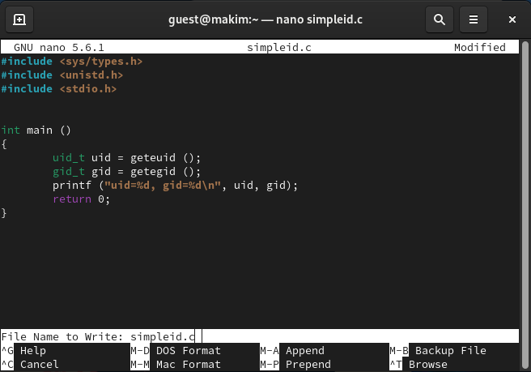

:::
::: {.column width="25%"}

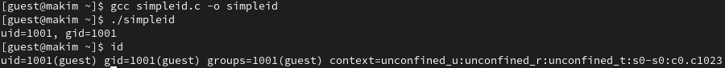

:::
::: {.column width="25%"}

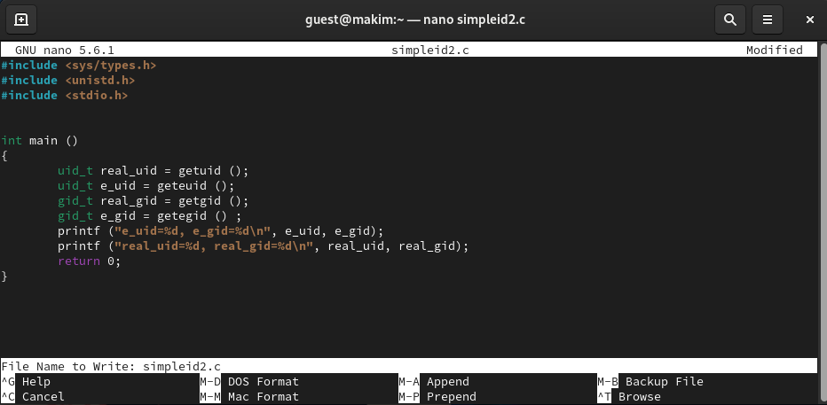

:::
::: {.column width="25%"}

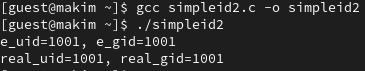

:::
::::::::::::::

## Создание программ и изучение SetUID- и SeetGUI-битов. 2

:::::::::::::: {.columns align=top}
::: {.column width="33%"}

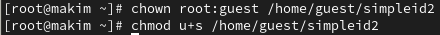

:::
::: {.column width="33%"}

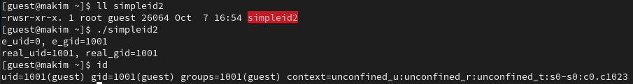

:::
::: {.column width="33%"}

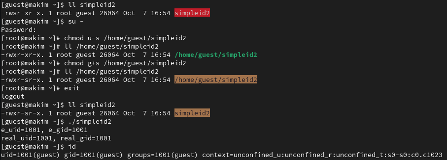

:::
::::::::::::::

## Создание программ и изучение SetUID- и SeetGUI-битов. 3

:::::::::::::: {.columns align=top}
::: {.column width="25%"}

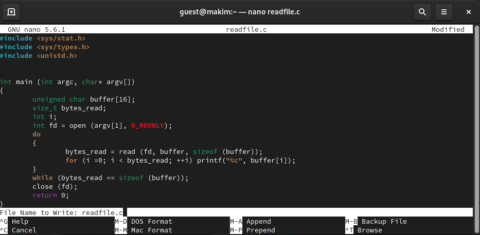

:::
::: {.column width="25%"}

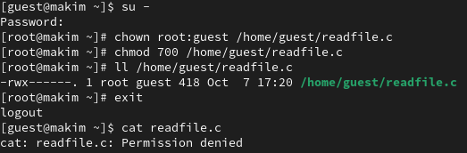

:::
::: {.column width="25%"}

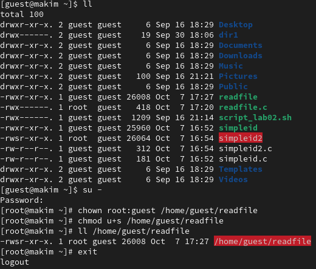

:::
::: {.column width="25%"}

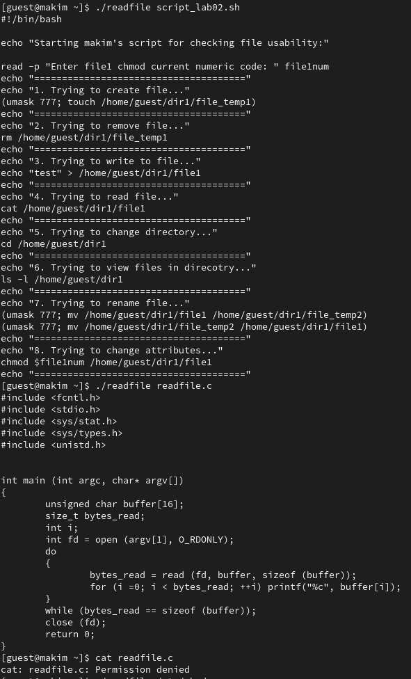

:::
::::::::::::::

## Создание программ и изучение SetUID- и SeetGUI-битов. 4

:::::::::::::: {.columns align=top}
::: {.column width="50%"}

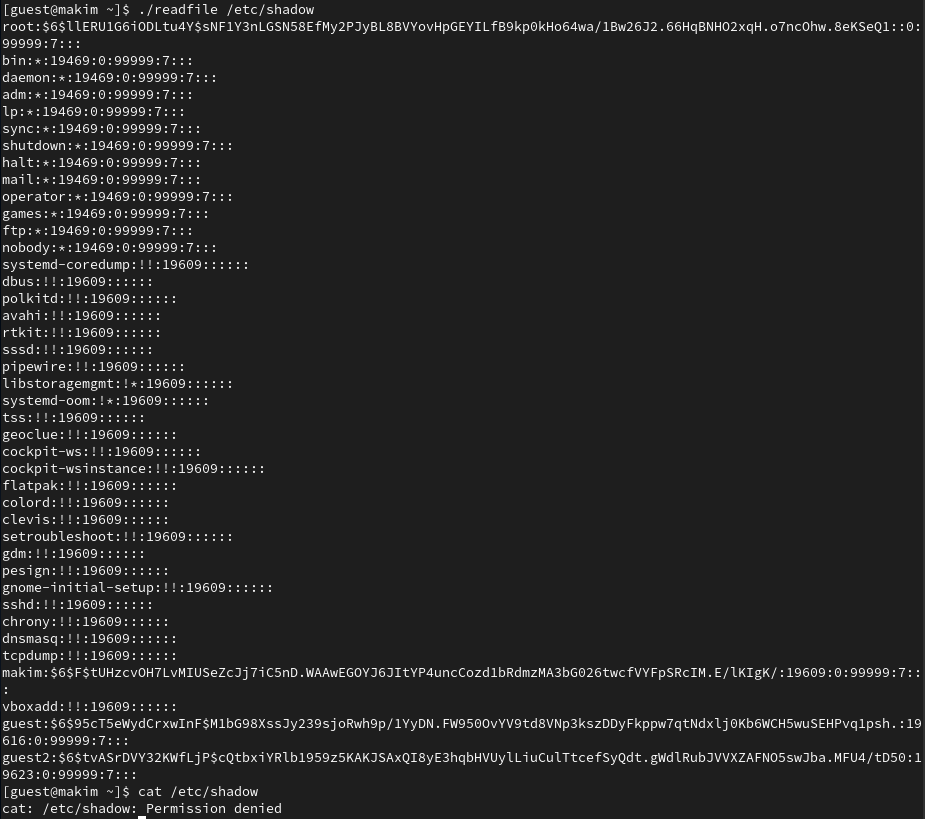

:::
::::::::::::::

## Исследование Sticky-бита. 1

:::::::::::::: {.columns align=top}
::: {.column width="25%"}

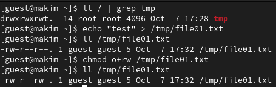

:::
::: {.column width="25%"}

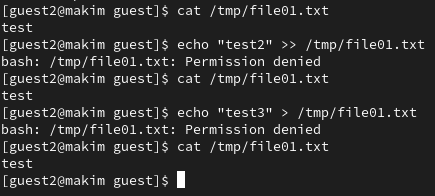

:::
::: {.column width="25%"}

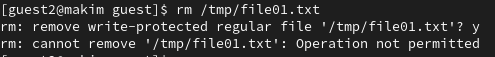

:::
::: {.column width="25%"}

:::
::::::::::::::

## Исследование Sticky-бита. 2

:::::::::::::: {.columns}
::: {.column}

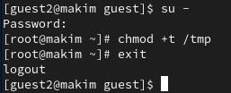

:::
::::::::::::::

# Результаты

- Выполнены все необходимые задания.

## Вывод

Изучены механизмы изменения идентификаторов, применения SetUID- и Sticky-битов. Получены практические навыкы работы в консоли с дополнительными атрибутами. Рассмотрена работа механизма смены идентификатора процессов пользователей, а также влияние бита Sticky на запись и удаление файлов.