---
## Front matter
title: "Отчет по лабораторной работе №5"
subtitle: "по дисциплине: Информационная безопасность"
author: "Ким Михаил Алексеевич"

## Generic otions
lang: ru-RU
toc-title: "Содержание"

## Bibliography
bibliography: bib/cite.bib
csl: pandoc/csl/gost-r-7-0-5-2008-numeric.csl

## Pdf output format
toc: true # Table of contents
toc-depth: 2
lof: true # List of figures
lot: false # List of tables
fontsize: 12pt
linestretch: 1.5
papersize: a4
documentclass: scrreprt
## I18n polyglossia
polyglossia-lang:
  name: russian
  options:
	- spelling=modern
	- babelshorthands=true
polyglossia-otherlangs:
  name: english
## I18n babel
babel-lang: russian
babel-otherlangs: english
## Fonts
mainfont: PT Serif
romanfont: PT Serif
sansfont: PT Sans
monofont: PT Mono
mainfontoptions: Ligatures=TeX
romanfontoptions: Ligatures=TeX
sansfontoptions: Ligatures=TeX,Scale=MatchLowercase
monofontoptions: Scale=MatchLowercase,Scale=0.9
## Biblatex
biblatex: true
biblio-style: "gost-numeric"
biblatexoptions:
  - parentracker=true
  - backend=biber
  - hyperref=auto
  - language=auto
  - autolang=other*
  - citestyle=gost-numeric
## Pandoc-crossref LaTeX customization
figureTitle: "Рис."
tableTitle: "Таблица"
listingTitle: "Листинг"
lofTitle: "Список иллюстраций"
lotTitle: "Список таблиц"
lolTitle: "Листинги"
## Misc options
indent: true
header-includes:
  - \usepackage{indentfirst}
  - \usepackage{float} # keep figures where there are in the text
  - \floatplacement{figure}{H} # keep figures where there are in the text
---

# Цель работы

Изучение механизмов изменения идентификаторов, применения SetUID- и Sticky-битов. Получение практических навыков работы в консоли с дополнительными атрибутами. Рассмотрение работы механизма смены идентификатора процессов пользователей, а также влияние бита Sticky на запись и удаление файлов.

# Задание

1. Произвести эксперименты с дополнительными атрибутами прав доступа.

# Теоретическое введение
## Термины

- Терминал (или «Bash», сокращение от «Bourne-Again shell») — это программа, которая используется для взаимодействия с командной оболочкой. Терминал применяется для выполнения административных задач, например: установку пакетов, действия с файлами и управление пользователями. [@terminal]

- Права доступа определяют, какие действия конкретный пользователь может или не может совершать с определенным файлами и каталогами. [@mode]

- В UNIX-системах, кроме стандартных прав доступа, существуют также дополнительные или специальные атрибуты файлов, которые поддерживает файловая система. [@mode-attr]

- Setuid – это бит разрешения, который позволяет пользователю запускать исполняемый файл с правами владельца этого файла. Другими словами, использование этого бита позволяет нам поднять привилегии пользователя в случае, если это необходимо.

- Sticky Bit - в случае, если этот бит установлен для папки, то файлы в этой папке могут быть удалены только их владельцем. [@mode-bits]


# Выполнение лабораторной работы
## Создание программы

1. Создадим программу `simpleid.c` от имени пользователя guest командой `nano simpleid.c` (рис. @fig:01).
  
    ```c
    #include <sys/types.h>
    #include <unistd.h>
    #include <stdio.h>


    int main ()
    {
      uid_t uid = geteuid ();
      gid_t gid = getegid ();
      printf ("uid=%d, gid=%d\n", uid, gid);
      return 0;
    }
    ```

    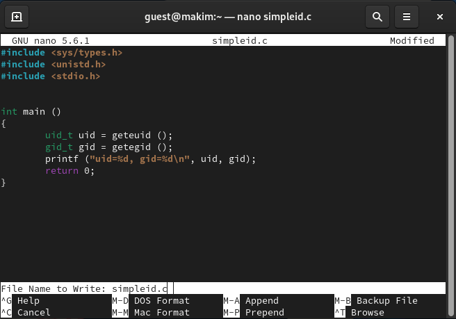{#fig:01 width=86%}

2. Скомплилируем и выполним программу. Сравним полученный результат с выполнением системной команды `id`: информация совпадает (рис. @fig:02). 

    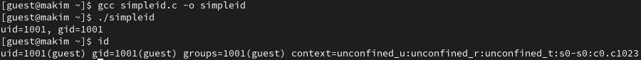{#fig:02 width=86%}


3. Усложним программу, добавив вывод действительных идентификаторов. Назовем программу `simpleid2.c` (рис. @fig:03).

    ```c
    #include <sys/types.h>
    #include <unistd.h>
    #include <stdio.h>


    int main ()
    {
      uid_t real_uid = getuid ();
      uid_t e_uid = geteuid ();
      gid_t real_gid = getgid ();
      gid_t e_gid = getegid () ;
      printf ("e_uid=%d, e_gid=%d\n", e_uid, e_gid);
      printf ("real_uid=%d, real_gid=%d\n", real_uid, real_gid);
      return 0;
    }
    ```

    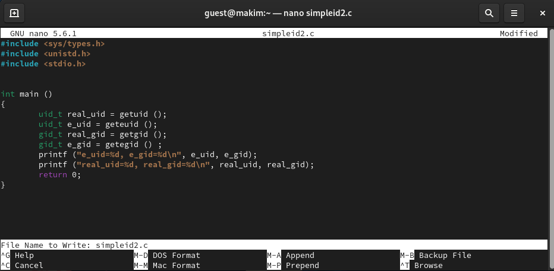{#fig:03 width=86%}

4. Скомпилируем и выполним программу (рис. @fig:04).

    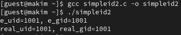{#fig:04 width=86%}


5. От имени суперпользователя выполните команды: `chown root:guest /home/guest/simpleid2` - изменяем владельца файла `simpleid2` с `guest` на `root` с указанием группы; chmod u+s /home/guest/simpleid2 - добавляем на файл SetUID-бит (рис. @fig:05).

    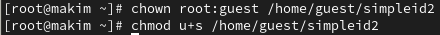{#fig:05 width=86%}

6. Выполним проверку правильности установки новых атрибутов и смены владельца файла simpleid2 командой `ll simpleid2`. Запустим simpleid2 и id командами: `./simpleid2` и `id`. Сравним результаты: `e_uid` у нас изменилось (рис. @fig:06).
   
    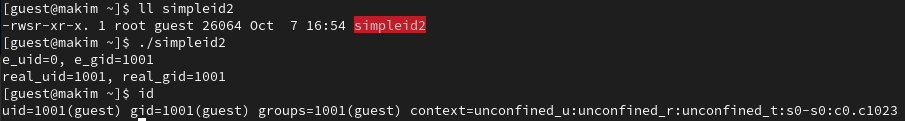{#fig:06 width=86%}

7. Проделаем аналогичные действия относительно SetGID-бита. Как видим, `e_uid` у нас снова изменился (рис. @fig:65).
   
    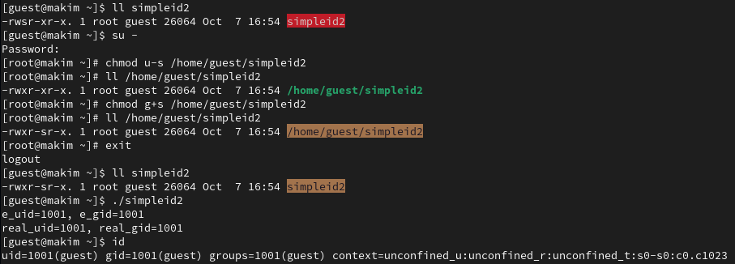{#fig:65 width=86%}

8. Создадим программу `readfile.c` (рис. @fig:07).

    ```c
    #include <fcntl.h>
    #include <stdio.h>
    #include <sys/stat.h>
    #include <sys/types.h>
    #include <unistd.h>


    int main (int argc, char* argv[])
    {
      unsigned char buffer[16];
      size_t bytes_read;
      int i;
      int fd = open (argv[1], O_RDONLY);
      do
      {
        bytes_read = read (fd, buffer, sizeof (buffer));
        for (i =0; i < bytes_read; ++i) printf("%c", buffer[i]);
      }
      while (bytes_read == sizeof (buffer));
      close (fd);
      return 0;
    }
    ```
   
    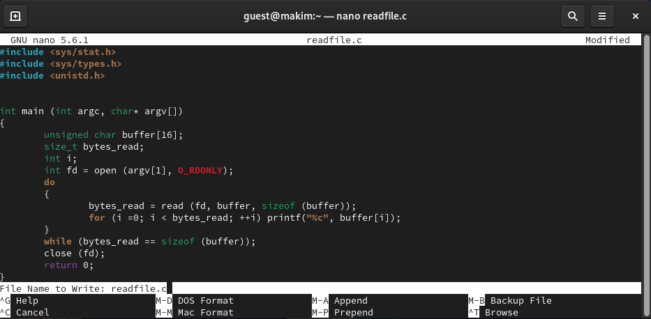{#fig:07 width=86%}

9. Сменим владельца у файла `readfile.c` и изменим права так, чтобы только суперпользователь (root) мог прочитать его, a guest не мог. Проверим, что пользователь guest не может прочитать файл `readfile.c`. (рис. @fig:08).
   
    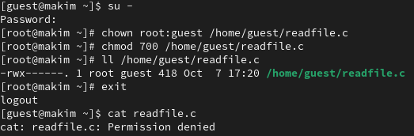{#fig:08 width=86%}

10. Сменим у программы `readfile` владельца и установим SetUD-бит (рис. @fig:09).
   
    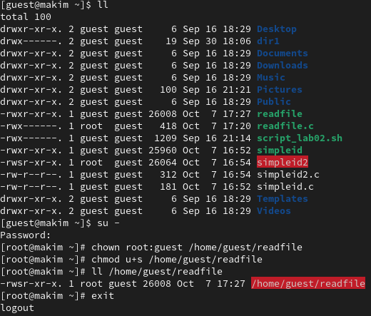{#fig:09 width=86%}

10. Проверим, может ли программа прочитать мой собственный файл, файл readfile.c, файл /etc/shadow. Как мы видим, программа может это сделать, так как владелец данной программы - суперпользователь (root) и установлен SetUD-бит. Соответственно, запуск программы осуществляется с правами пользователя - root. Поэтому мы имеем доступ к файлам, недоступным для пользователя guest (рис. @fig:10, @fig:11).
   
    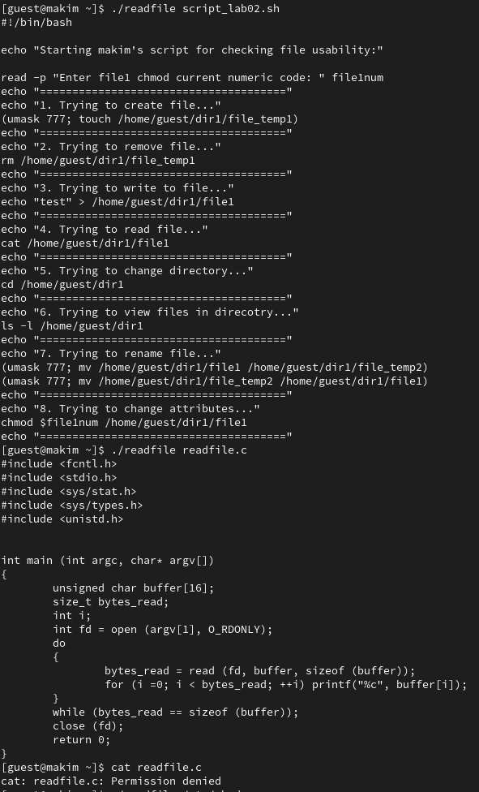{#fig:10 width=86%}

    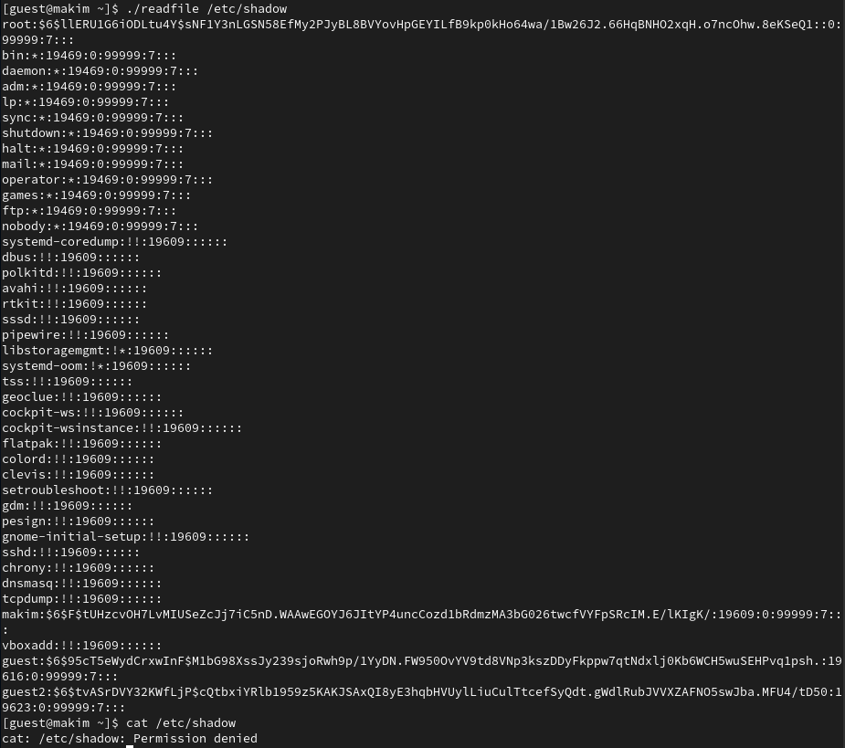{#fig:11 width=86%}


## Исследование Sticky-бита

1. Выясним, установлен ли атрибут Sticky на директории /tmp, для чего выполним команду `ll / | grep tmp`. От имени пользователя guest создайте файл `file01.txt` в директории /tmp со словом `test` командой: `echo "test" > /tmp/file01.txt`. Просмотрим атрибуты у только что созданного файла и разрешим чтение и запись для категории пользователей «все остальные» командами: `ll /tmp/file01.txt`, `chmod o+rw /tmp/file01.txt`, `ll /tmp/file01.txt` (рис. @fig:12).

    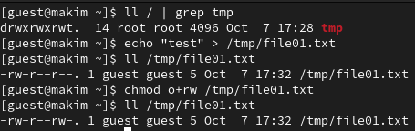{#fig:12 width=86%}

2. От пользователя guest2 попробуем дозаписать в файл `/tmp/file01.txt` слово `test2` командой `echo "test2" >> /tmp/file01.txt`. Выполнить данную операцию нельзя. От пользователя guest2 попробуем записать в файл `/tmp/file01.txt` слово `test3`, стерев при этом всю имеющуюся в файле информацию командой `echo "test3" > /tmp/file01.txt`. Выполнить данную операцию нельзя. (рис. @fig:13).

    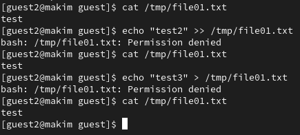{#fig:13 width=86%}

3. От пользователя guest2 попробуем удалить файл `/tmp/file01.txt` `rm /tmp/fileOl.txt`. Выполнить данную операцию нельзя. (рис. @fig:14).

    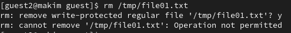{#fig:14 width=86%}

4. Повысим свои права до суперпользователя и выполним команду, снимающую атрибут t с директории /tmp: `chmod -t /tmp`. Покинем режим суперпользователя. Проверим, снят ли атрибут `t` у директории `/tmp`. Повторим предыдущие шаги: теперь мы имеем возможность удалить файл /tmp/file01.txt (рис. @fig:15).

    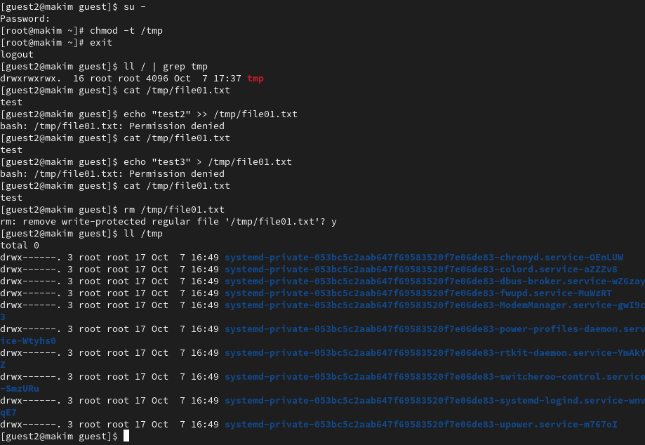{#fig:15 width=86%}

5. Вернем обратно законный атрибут `t` для директории `/tmp` (рис. @fig:16).

    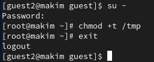{#fig:16 width=86%}


# Анализ результатов

Работа выполнена без каких-либо проблем. Работа с терминалом ОС Rocky Linux в данном случае нареканий не вызвала. Также порадовало наличие вкладок в терминале «из коробки».

# Выводы

Изучены механизмы изменения идентификаторов, применения SetUID- и Sticky-битов. Получены практические навыкы работы в консоли с дополнительными атрибутами. Рассмотрена работа механизма смены идентификатора процессов пользователей, а также влияние бита Sticky на запись и удаление файлов.

# Список литературы{.unnumbered}

::: {#refs}
:::
