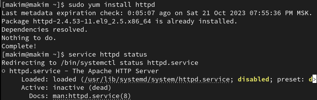

---
## Front matter
title: "Отчет по лабораторной работе №6"
subtitle: "по дисциплине: Информационная безопасность"
author: "Ким Михаил Алексеевич"

## Generic otions
lang: ru-RU
toc-title: "Содержание"

## Bibliography
bibliography: bib/cite.bib
csl: pandoc/csl/gost-r-7-0-5-2008-numeric.csl

## Pdf output format
toc: true # Table of contents
toc-depth: 2
lof: true # List of figures
lot: false # List of tables
fontsize: 12pt
linestretch: 1.5
papersize: a4
documentclass: scrreprt
## I18n polyglossia
polyglossia-lang:
  name: russian
  options:
	- spelling=modern
	- babelshorthands=true
polyglossia-otherlangs:
  name: english
## I18n babel
babel-lang: russian
babel-otherlangs: english
## Fonts
mainfont: PT Serif
romanfont: PT Serif
sansfont: PT Sans
monofont: PT Mono
mainfontoptions: Ligatures=TeX
romanfontoptions: Ligatures=TeX
sansfontoptions: Ligatures=TeX,Scale=MatchLowercase
monofontoptions: Scale=MatchLowercase,Scale=0.9
## Biblatex
biblatex: true
biblio-style: "gost-numeric"
biblatexoptions:
  - parentracker=true
  - backend=biber
  - hyperref=auto
  - language=auto
  - autolang=other*
  - citestyle=gost-numeric
## Pandoc-crossref LaTeX customization
figureTitle: "Рис."
tableTitle: "Таблица"
listingTitle: "Листинг"
lofTitle: "Список иллюстраций"
lotTitle: "Список таблиц"
lolTitle: "Листинги"
## Misc options
indent: true
header-includes:
  - \usepackage{indentfirst}
  - \usepackage{float} # keep figures where there are in the text
  - \floatplacement{figure}{H} # keep figures where there are in the text
---

# Цель работы

Развитие навыков администрирования ОС Linux. Получение первого практического знакомства с технологией SELinux. Проверка работы SELinx на практике совместно с веб-сервером Apache.

# Задание

1. Произвести эксперименты с дополнительными атрибутами прав доступа.

# Теоретическое введение

- Терминал (или «Bash», сокращение от «Bourne-Again shell») — это программа, которая используется для взаимодействия с командной оболочкой. Терминал применяется для выполнения административных задач, например: установку пакетов, действия с файлами и управление пользователями [@terminal].

- Права доступа определяют, какие действия конкретный пользователь может или не может совершать с определенным файлами и каталогами [@mode].

- В UNIX-системах, кроме стандартных прав доступа, существуют также дополнительные или специальные атрибуты файлов, которые поддерживает файловая система [@mode-attr].

- SELinux (SELinux) — это система принудительного контроля доступа, реализованная на уровне ядра [@selinux].

- Apache («Апачи», Apache HTTP Server) — это открытое кросс-платформенное программное обеспечение для размещения и поддержки веб-сервера [@apache].


# Выполнение лабораторной работы

1. Войдем в систему с полученными учётными данными и убедимся, что SELinux работает в режиме enforcing политики targeted с помощью команд `getenforce` и `sestatus`. (рис. @fig:01).

    {#fig:01 width=86%}

2. Обратимся с помощью браузера к веб-серверу, запущенному на компьютере, и убедимся, что последний работает: `service httpd status`. Предварительно установим пакет: `sudo yum install httpd`. Если не работает, запустим его так же, но с параметром `start`. (рис. @fig:02, @fig:03). 

    {#fig:02 width=86%}

    {#fig:03 width=86%}

3. Найдем веб-сервер Apache в списке процессов, определим его контекст безопасности и занесем эту информацию в отчёт. Например, можно использовать команды: `ps auxZ | grep httpd`, `ps -eZ | grep httpd` (рис. @fig:04).

    {#fig:04 width=86%}

4. Посмотрим текущее состояние переключателей SELinux для Apache с помощью команды `sestatus -bigrep httpd` (рис. @fig:05).

    {#fig:05 width=86%}

5. Посмотрим статистику по политике с помощью команды seinfo (предварительно установив необходимый пакет), также определим множество пользователей, ролей, типов. (рис. @fig:06).
   
    {#fig:06 width=86%}

6. Определим тип файлов и поддиректорий, находящихся в директории `/var/www`, с помощью команды `ls -lZ /var/www`. Определим тип файлов, находящихся в директории `/var/www/html`: `ls -lZ /var/www/html`. Определите круг пользователей, которым разрешено создание файлов в директории `/var/www/html`: `ll /var/www/html`. Создадим от имени суперпользователя html-файл `/var/www/html/test.html` следующего содержания (рис. @fig:07):
    ```html
    <html>
    <body>test</body>
    </html>
    ```

    {#fig:07 width=86%}

7. Проверим контекст созданного файла: `ls -Z /var/www/html`.(рис. @fig:08).
   
    {#fig:08 width=86%}

8. Обратимся к файлу через веб-сервер, введя в браузере адрес http://127.0.0.1/test.html. Убедимся, что файл был успешно отображён. (рис. @fig:09).
   
    {#fig:09 width=86%}

9. Проверим контекст файла командой: `ls -Z /var/www/html/test.html` (рис. @fig:10).

    {#fig:10 width=86%}

10. Изменим контекст файла `/var/www/html/test.html` с `httpd_sys_content_t` на любой другой, к которому процесс `httpd` не должен иметь доступа, например, на `samba_share_t`: `chcon -t samba_share_t /var/www/html/test.html`, `ls -Z /var/www/html/test.html`. После этого проверим, что контекст поменялся. При попытку получить доступ к файлу получаем сообщение об ошибке (рис. @fig:11).
   
    {#fig:11 width=86%}

11. Просмотрим log-файлы (рис. @fig:12).
   
    {#fig:12 width=86%}

12. Попробуем запустить веб-сервер Apache на прослушивание ТСР-порта 81 (а не 80, как рекомендует IANA и прописано в `/etc/services`). Для этого в файле `/etc/httpd/httpd.conf` найдем строчку `Listen 80` и заменим её на `Listen 81` (рис. @fig:13).

    {#fig:13 width=86%}

13. Запустить веб-сервер удалось, т.к. TCP-порт 81 уже находится в списке прослушиваемых портов (рис. @fig:14).
   
    {#fig:14 width=86%}

14. Вернем контекст httpd_sys_cоntent__t к файлу /var/www/html/ test.html: chcon -t httpd_sys_content_t /var/www/html/test.html. После этого попробуйте получить доступ к файлу через веб-сервер, введя в браузере адрес http://127.0.0.1:81/test.html. (рис. @fig:16, @fig:15).

    {#fig:16 width=86%}

    {#fig:15 width=86%}

15. Исправим обратно конфигурационный файл apache, вернув Listen 80. (рис. @fig:17).
   
    {#fig:17 width=86%}

16. Удалить привязку http_port_t к 81 порту невозможно из-за политики (рис. @fig:18).
   
    {#fig:18 width=86%}

17. Удалим файл `/var/www/html/test.html`: `rm /var/www/html/test.html` (рис. @fig:19).
   
    {#fig:19 width=86%}
   
# Анализ результатов

Работа выполнена без каких-либо проблем. Работа с терминалом ОС Rocky Linux в данном случае нареканий не вызвала.

# Выводы

Развиты навыки администрирования ОС Linux. Полученое первое практическое знакомство с технологией SELinux. Проверена работа SELinx на практике совместно с веб-сервером Apache.

# Список литературы{.unnumbered}

::: {#refs}
:::
