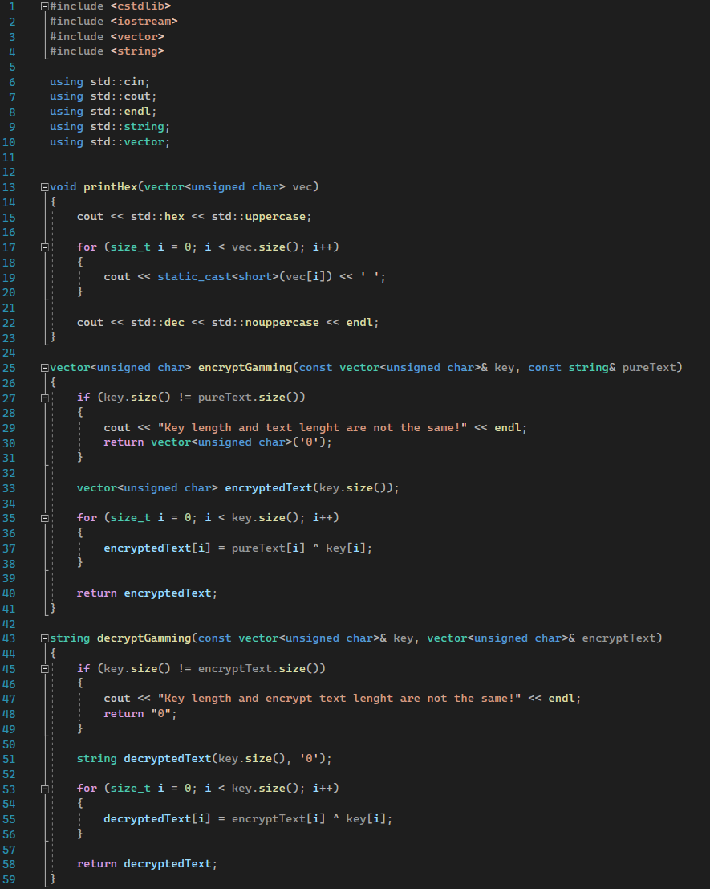
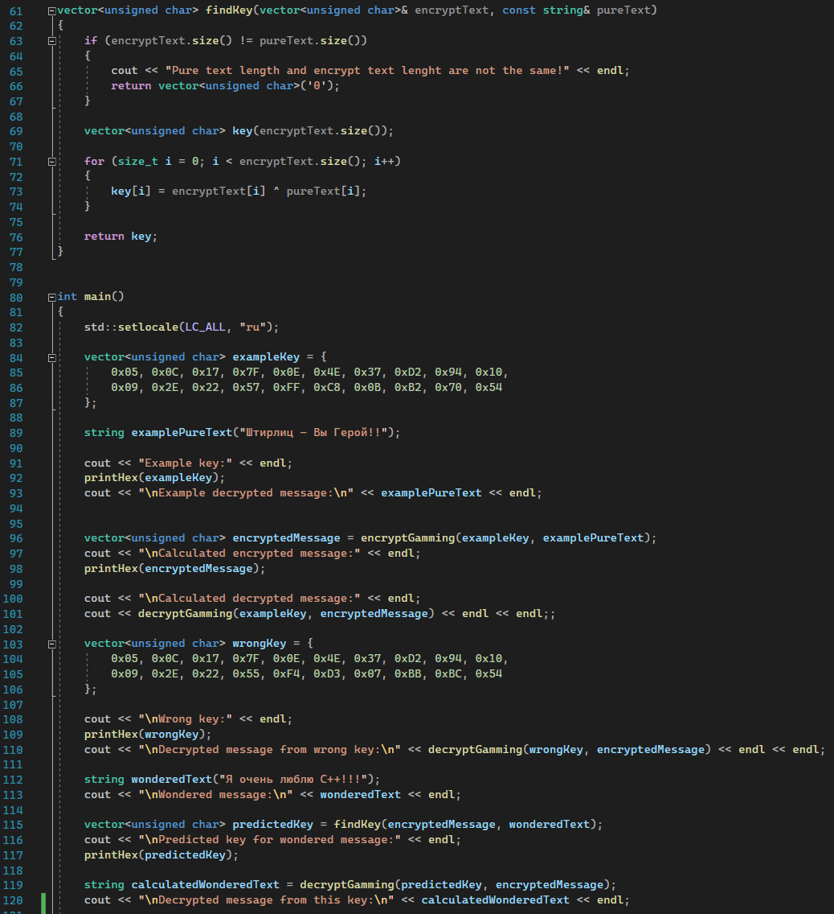
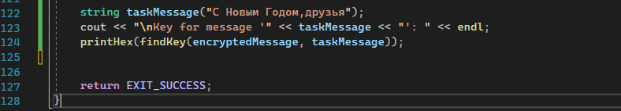
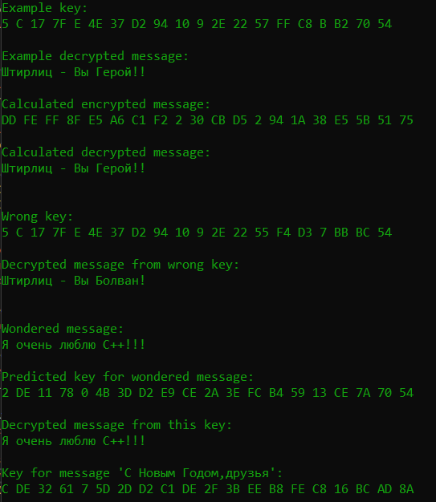

---
## Front matter
title: "Отчет по лабораторной работе №7"
subtitle: "по дисциплине: Информационная безопасность"
author: "Ким Михаил Алексеевич"

## Generic otions
lang: ru-RU
toc-title: "Содержание"

## Bibliography
bibliography: bib/cite.bib
csl: pandoc/csl/gost-r-7-0-5-2008-numeric.csl

## Pdf output format
toc: true # Table of contents
toc-depth: 2
lof: true # List of figures
lot: false # List of tables
fontsize: 12pt
linestretch: 1.5
papersize: a4
documentclass: scrreprt
## I18n polyglossia
polyglossia-lang:
  name: russian
  options:
	- spelling=modern
	- babelshorthands=true
polyglossia-otherlangs:
  name: english
## I18n babel
babel-lang: russian
babel-otherlangs: english
## Fonts
mainfont: PT Serif
romanfont: PT Serif
sansfont: PT Sans
monofont: PT Mono
mainfontoptions: Ligatures=TeX
romanfontoptions: Ligatures=TeX
sansfontoptions: Ligatures=TeX,Scale=MatchLowercase
monofontoptions: Scale=MatchLowercase,Scale=0.9
## Biblatex
biblatex: true
biblio-style: "gost-numeric"
biblatexoptions:
  - parentracker=true
  - backend=biber
  - hyperref=auto
  - language=auto
  - autolang=other*
  - citestyle=gost-numeric
## Pandoc-crossref LaTeX customization
figureTitle: "Рис."
tableTitle: "Таблица"
listingTitle: "Листинг"
lofTitle: "Список иллюстраций"
lotTitle: "Список таблиц"
lolTitle: "Листинги"
## Misc options
indent: true
header-includes:
  - \usepackage{indentfirst}
  - \usepackage{float} # keep figures where there are in the text
  - \floatplacement{figure}{H} # keep figures where there are in the text
---

# Цель работы

Освоить на практике применение режима однократного гаммирования.

# Задание

Нужно подобрать ключ, чтобы получить сообщение «С Новым Годом, друзья!». Требуется разработать приложение, позволяющее шифровать и дешифровать данные в режиме однократного гаммирования. Приложение должно:

1. Определить вид шифротекста при известном ключе и известном открытом тексте.

2. Определить ключ, с помощью которого шифротекст может быть преобразован в некоторый фрагмент текста, представляющий собой один из возможных вариантов прочтения открытого текста.

# Теоретическое введение

- Терминал (или «Bash», сокращение от «Bourne-Again shell») — это программа, которая используется для взаимодействия с командной оболочкой. Терминал применяется для выполнения административных задач, например: установку пакетов, действия с файлами и управление пользователями. [@terminal]

- Гамми́рование, или Шифр XOR, — метод симметричного шифрования, заключающийся в «наложении» последовательности, состоящей из случайных чисел, на открытый текст. Последовательность случайных чисел называется гамма-последовательностью и используется для зашифровывания и расшифровывания данных. Суммирование обычно выполняется в каком-либо конечном поле. Например, в поле Галуа суммирование принимает вид операции «исключающее ИЛИ (XOR)» [@xor].


# Выполнение лабораторной работы
## Создание программы

1. Напишем программу на C++, удовлетворяющую всем условиям задания. Программа будет содержать четыре вспомогательные функции: вывод информации в 16-ричной системе счисления, кодирование и декодирование информации, нахождение ключа по исходному тексту и шифротексту. (рис. @fig:01, @fig:02, @fig:03).
  
    ```cpp
    #include <cstdlib>
    #include <iostream>
    #include <vector>
    #include <string>

    using std::cin;
    using std::cout;
    using std::endl;
    using std::string;
    using std::vector;


    void printHex(vector<unsigned char> vec)
    {
        cout << std::hex << std::uppercase;

        for (size_t i = 0; i < vec.size(); i++)
        {
            cout << static_cast<short>(vec[i]) << ' ';
        }

        cout << std::dec << std::nouppercase << endl;
    }

    vector<unsigned char> encryptGamming(const vector<unsigned char>& key, const string& pureText)
    {
        if (key.size() != pureText.size())
        {
            cout << "Key length and text lenght are not the same!" << endl;
            return vector<unsigned char>('0');
        }

        vector<unsigned char> encryptedText(key.size());

        for (size_t i = 0; i < key.size(); i++)
        {
            encryptedText[i] = pureText[i] ^ key[i];
        }

        return encryptedText;
    }

    string decryptGamming(const vector<unsigned char>& key, vector<unsigned char>& encryptText)
    {
        if (key.size() != encryptText.size())
        {
            cout << "Key length and encrypt text lenght are not the same!" << endl;
            return "0";
        }

        string decryptedText(key.size(), '0');

        for (size_t i = 0; i < key.size(); i++)
        {
            decryptedText[i] = encryptText[i] ^ key[i];
        }

        return decryptedText;
    }

    vector<unsigned char> findKey(vector<unsigned char>& encryptText, const string& pureText)
    {
        if (encryptText.size() != pureText.size())
        {
            cout << "Pure text length and encrypt text lenght are not the same!" << endl;
            return vector<unsigned char>('0');
        }

        vector<unsigned char> key(encryptText.size());

        for (size_t i = 0; i < encryptText.size(); i++)
        {
            key[i] = encryptText[i] ^ pureText[i];
        }

        return key;
    }


    int main()
    {
        std::setlocale(LC_ALL, "ru");

        vector<unsigned char> exampleKey = {
            0x05, 0x0C, 0x17, 0x7F, 0x0E, 0x4E, 0x37, 0xD2, 0x94, 0x10,
            0x09, 0x2E, 0x22, 0x57, 0xFF, 0xC8, 0x0B, 0xB2, 0x70, 0x54
        };

        string examplePureText("Штирлиц – Вы Герой!!");

        cout << "Example key:" << endl;
        printHex(exampleKey);
        cout << "\nExample decrypted message:\n" << examplePureText << endl;


        vector<unsigned char> encryptedMessage = encryptGamming(exampleKey, examplePureText);
        cout << "\nCalculated encrypted message:" << endl;
        printHex(encryptedMessage);

        cout << "\nCalculated decrypted message:" << endl;
        cout << decryptGamming(exampleKey, encryptedMessage) << endl << endl;;

        vector<unsigned char> wrongKey = {
            0x05, 0x0C, 0x17, 0x7F, 0x0E, 0x4E, 0x37, 0xD2, 0x94, 0x10,
            0x09, 0x2E, 0x22, 0x55, 0xF4, 0xD3, 0x07, 0xBB, 0xBC, 0x54
        };

        cout << "\nWrong key:" << endl;
        printHex(wrongKey);
        cout << "\nDecrypted message from wrong key:\n" << decryptGamming(wrongKey, encryptedMessage) << endl << endl;

        string wonderedText("Я очень люблю C++!!!");
        cout << "\nWondered message:\n" << wonderedText << endl;

        vector<unsigned char> predictedKey = findKey(encryptedMessage, wonderedText);
        cout << "\nPredicted key for wondered message:" << endl;
        printHex(predictedKey);

        string calculatedWonderedText = decryptGamming(predictedKey, encryptedMessage);
        cout << "\nDecrypted message from this key:\n" << calculatedWonderedText << endl;

        string taskMessage("С Новым Годом,друзья");
        cout << "\nKey for message '" << taskMessage << "': " << endl;
        printHex(findKey(encryptedMessage, taskMessage));


        return EXIT_SUCCESS;
    }
    ```

    {#fig:01 width=86%}

    {#fig:02 width=86%}

    {#fig:03 width=86%}

2. Результат работы программы после компиляции и выполнения (рис. @fig:04). 

    {#fig:04 width=86%}


# Анализ результатов

Работа выполнена без каких-либо серьезных нареканий. Единственным моментом, которому было уделено больше внимания, чем он того заслуживает, стал выбор типа данных для хранения текста, шифротекста и ключа.

# Выводы

Освоено на практике применение режима однократного гаммирования.

# Список литературы{.unnumbered}

::: {#refs}
:::
