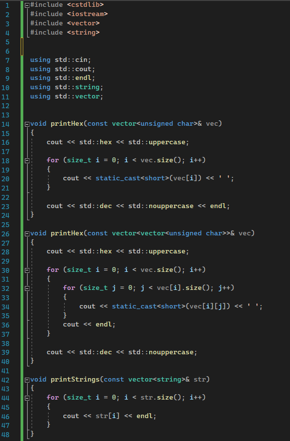
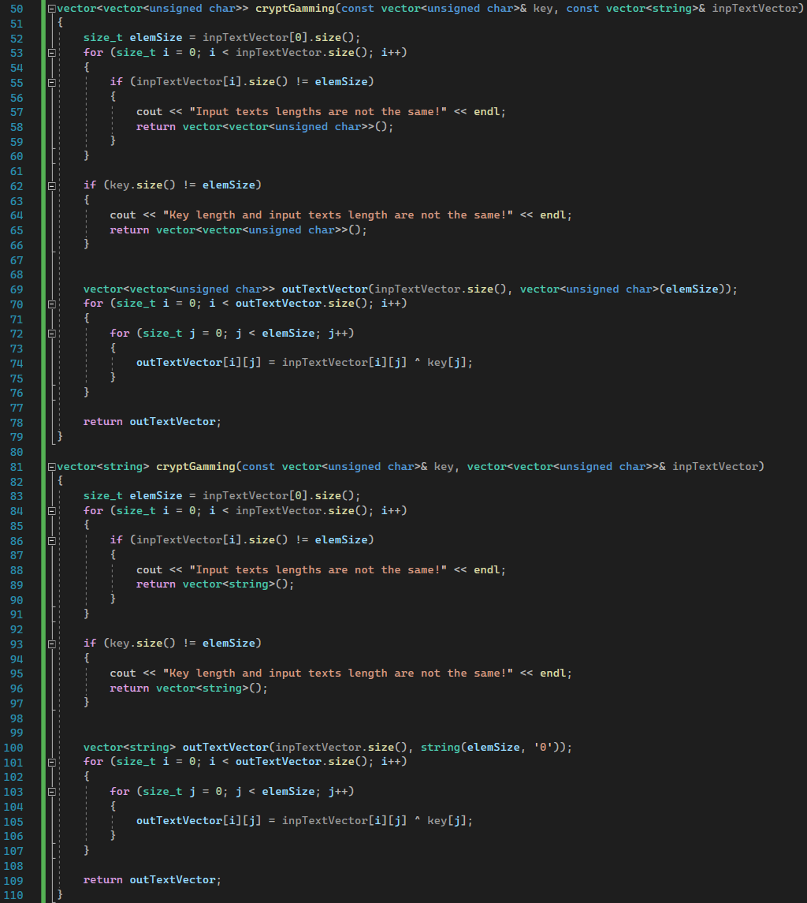
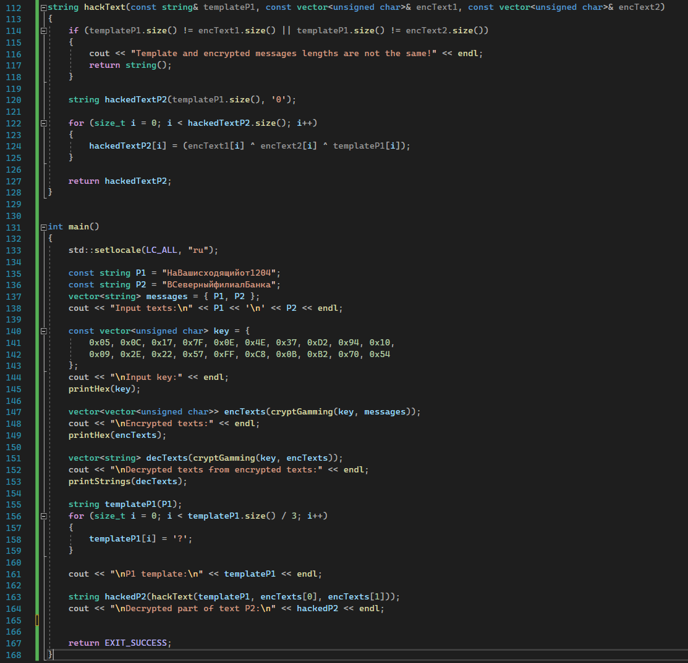
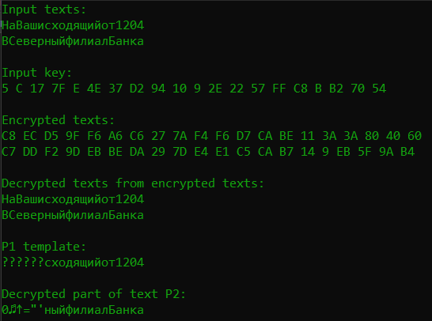

---
## Front matter
title: "Отчет по лабораторной работе №8"
subtitle: "по дисциплине: Информационная безопасность"
author: "Ким Михаил Алексеевич"

## Generic otions
lang: ru-RU
toc-title: "Содержание"

## Bibliography
bibliography: bib/cite.bib
csl: pandoc/csl/gost-r-7-0-5-2008-numeric.csl

## Pdf output format
toc: true # Table of contents
toc-depth: 2
lof: true # List of figures
lot: false # List of tables
fontsize: 12pt
linestretch: 1.5
papersize: a4
documentclass: scrreprt
## I18n polyglossia
polyglossia-lang:
  name: russian
  options:
	- spelling=modern
	- babelshorthands=true
polyglossia-otherlangs:
  name: english
## I18n babel
babel-lang: russian
babel-otherlangs: english
## Fonts
mainfont: PT Serif
romanfont: PT Serif
sansfont: PT Sans
monofont: PT Mono
mainfontoptions: Ligatures=TeX
romanfontoptions: Ligatures=TeX
sansfontoptions: Ligatures=TeX,Scale=MatchLowercase
monofontoptions: Scale=MatchLowercase,Scale=0.9
## Biblatex
biblatex: true
biblio-style: "gost-numeric"
biblatexoptions:
  - parentracker=true
  - backend=biber
  - hyperref=auto
  - language=auto
  - autolang=other*
  - citestyle=gost-numeric
## Pandoc-crossref LaTeX customization
figureTitle: "Рис."
tableTitle: "Таблица"
listingTitle: "Листинг"
lofTitle: "Список иллюстраций"
lotTitle: "Список таблиц"
lolTitle: "Листинги"
## Misc options
indent: true
header-includes:
  - \usepackage{indentfirst}
  - \usepackage{float} # keep figures where there are in the text
  - \floatplacement{figure}{H} # keep figures where there are in the text
---

# Цель работы

Освоить на практике применение режима однократного гаммирования на примере кодирования различных исходных текстов одним ключом.

# Задание

Два текста кодируются одним ключом (однократное гаммирование). Требуется не зная ключа и не стремясь его определить, прочитать оба текста. Необходимо разработать приложение, позволяющее шифровать и дешифровать тексты P1 и P2 в режиме однократного гаммирования. Приложение должно определить вид шифротекстов C1 и C2 обоих текстов P1 и P2 при известном ключе. Необходимо определить и выразить аналитически способ, при котором злоумышленник может прочитать оба текста, не зная ключа и не стремясь его определить.

# Теоретическое введение

- Терминал (или «Bash», сокращение от «Bourne-Again shell») — это программа, которая используется для взаимодействия с командной оболочкой. Терминал применяется для выполнения административных задач, например: установку пакетов, действия с файлами и управление пользователями. [@terminal]

- Гамми́рование, или Шифр XOR, — метод симметричного шифрования, заключающийся в «наложении» последовательности, состоящей из случайных чисел, на открытый текст. Последовательность случайных чисел называется гамма-последовательностью и используется для зашифровывания и расшифровывания данных. Суммирование обычно выполняется в каком-либо конечном поле. Например, в поле Галуа суммирование принимает вид операции «исключающее ИЛИ (XOR)» [@xor].


# Выполнение лабораторной работы
## Создание программы

1. Напишем программу на C++, удовлетворяющую всем условиям задания. Программа будет содержать четыре вспомогательные функции и их перегрузки: вывод в консоль информации в 16-ричной системе счисления, вывод в консоль вектора строк, кодирование и декодирование информации, определение фрагмента текста по шаблону и шифротекстам. (рис. @fig:01, @fig:02, @fig:03).
  
    ```cpp
    #include <cstdlib>
    #include <iostream>
    #include <vector>
    #include <string>


    using std::cin;
    using std::cout;
    using std::endl;
    using std::string;
    using std::vector;


    void printHex(const vector<unsigned char>& vec)
    {
        cout << std::hex << std::uppercase;

        for (size_t i = 0; i < vec.size(); i++)
        {
            cout << static_cast<short>(vec[i]) << ' ';
        }

        cout << std::dec << std::nouppercase << endl;
    }

    void printHex(const vector<vector<unsigned char>>& vec)
    {
        cout << std::hex << std::uppercase;

        for (size_t i = 0; i < vec.size(); i++)
        {
            for (size_t j = 0; j < vec[i].size(); j++)
            {
                cout << static_cast<short>(vec[i][j]) << ' ';
            }
            cout << endl;
        }

        cout << std::dec << std::nouppercase;
    }

    void printStrings(const vector<string>& str)
    {
        for (size_t i = 0; i < str.size(); i++)
        {
            cout << str[i] << endl;
        }
    }

    vector<vector<unsigned char>> cryptGamming(const vector<unsigned char>& key, const vector<string>& inpTextVector)
    {
        size_t elemSize = inpTextVector[0].size();
        for (size_t i = 0; i < inpTextVector.size(); i++)
        {
            if (inpTextVector[i].size() != elemSize)
            {
                cout << "Input texts lengths are not the same!" << endl;
                return vector<vector<unsigned char>>();
            }
        }

        if (key.size() != elemSize)
        {
            cout << "Key length and input texts length are not the same!" << endl;
            return vector<vector<unsigned char>>();
        }


        vector<vector<unsigned char>> outTextVector(inpTextVector.size(), vector<unsigned char>(elemSize));
        for (size_t i = 0; i < outTextVector.size(); i++)
        {
            for (size_t j = 0; j < elemSize; j++)
            {
                outTextVector[i][j] = inpTextVector[i][j] ^ key[j];
            }
        }

        return outTextVector;
    }

    vector<string> cryptGamming(const vector<unsigned char>& key, vector<vector<unsigned char>>& inpTextVector)
    {
        size_t elemSize = inpTextVector[0].size();
        for (size_t i = 0; i < inpTextVector.size(); i++)
        {
            if (inpTextVector[i].size() != elemSize)
            {
                cout << "Input texts lengths are not the same!" << endl;
                return vector<string>();
            }
        }

        if (key.size() != elemSize)
        {
            cout << "Key length and input texts length are not the same!" << endl;
            return vector<string>();
        }


        vector<string> outTextVector(inpTextVector.size(), string(elemSize, '0'));
        for (size_t i = 0; i < outTextVector.size(); i++)
        {
            for (size_t j = 0; j < elemSize; j++)
            {
                outTextVector[i][j] = inpTextVector[i][j] ^ key[j];
            }
        }

        return outTextVector;
    }

    string hackText(const string& templateP1, const vector<unsigned char>& encText1, const vector<unsigned char>& encText2)
    {
        if (templateP1.size() != encText1.size() || templateP1.size() != encText2.size())
        {
            cout << "Template and encrypted messages lengths are not the same!" << endl;
            return string();
        }

        string hackedTextP2(templateP1.size(), '0');

        for (size_t i = 0; i < hackedTextP2.size(); i++)
        {
            hackedTextP2[i] = (encText1[i] ^ encText2[i] ^ templateP1[i]);
        }

        return hackedTextP2;
    }


    int main()
    {
        std::setlocale(LC_ALL, "ru");

        const string P1 = "НаВашисходящийот1204";
        const string P2 = "ВСеверныйфилиалБанка";
        vector<string> messages = { P1, P2 };
        cout << "Input texts:\n" << P1 << '\n' << P2 << endl;

        const vector<unsigned char> key = {
            0x05, 0x0C, 0x17, 0x7F, 0x0E, 0x4E, 0x37, 0xD2, 0x94, 0x10,
            0x09, 0x2E, 0x22, 0x57, 0xFF, 0xC8, 0x0B, 0xB2, 0x70, 0x54
        };
        cout << "\nInput key:" << endl;
        printHex(key);

        vector<vector<unsigned char>> encTexts(cryptGamming(key, messages));
        cout << "\nEncrypted texts:" << endl;
        printHex(encTexts);

        vector<string> decTexts(cryptGamming(key, encTexts));
        cout << "\nDecrypted texts from encrypted texts:" << endl;
        printStrings(decTexts);

        string templateP1(P1);
        for (size_t i = 0; i < templateP1.size() / 3; i++)
        {
            templateP1[i] = '?';
        }

        cout << "\nP1 template:\n" << templateP1 << endl;

        string hackedP2(hackText(templateP1, encTexts[0], encTexts[1]));
        cout << "\nDecrypted part of text P2:\n" << hackedP2 << endl;


        return EXIT_SUCCESS;
    }
    ```

    {#fig:01 width=86%}

    {#fig:02 width=86%}

    {#fig:03 width=86%}

2. Результат работы программы после компиляции и выполнения (рис. @fig:04). 

    {#fig:04 width=86%}


# Анализ результатов

Работа выполнена без каких-либо серьезных нареканий. Обожаю C++.

# Выводы

Освоено на практике применение режима однократного гаммирования на примере кодирования различных исходных текстов одним ключом.

# Список литературы{.unnumbered}

::: {#refs}
:::
