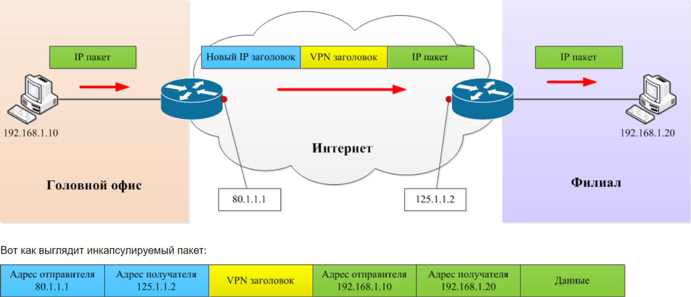
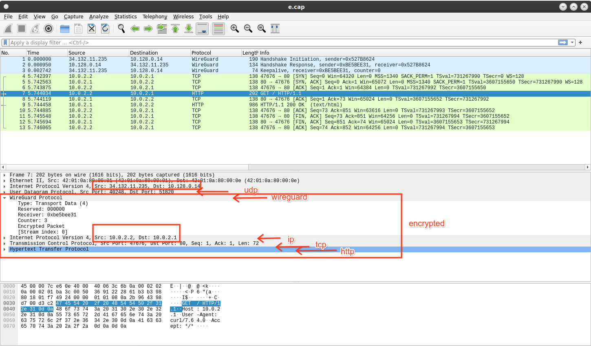

---
## Front matter
lang: ru-RU
title: Презентация к докладу
subtitle: Виртуальные частные сети
author:
  - Ким М. А.
institute:
  - Российский университет дружбы народов, Москва, Россия
date: 2 октября 2023

## i18n babel
babel-lang: russian
babel-otherlangs: english

## Fonts
mainfont: PT Serif
romanfont: PT Serif
sansfont: PT Sans
monofont: PT Mono
mainfontoptions: Ligatures=TeX
romanfontoptions: Ligatures=TeX
sansfontoptions: Ligatures=TeX,Scale=MatchLowercase
monofontoptions: Scale=MatchLowercase,Scale=0.9

## Formatting pdf
toc: false
toc-title: Содержание
slide_level: 2
aspectratio: 169
section-titles: true
theme: metropolis
header-includes:
 - \metroset{progressbar=frametitle,sectionpage=progressbar,numbering=fraction}
 - '\makeatletter'
 - '\beamer@ignorenonframefalse'
 - '\makeatother'
---

# Вводная часть

## Актуальность

- Ограниченность зарубежных ресурсов на территории РФ.
- Блокировки некоторых VPN-протоколов на территории РФ.

## Объект и предмет исследования

- VPS на базе Linux Ubuntu 20.4
- Клиенты на базе Windows 10, Linux Mint Cinnamon 21.1, Android, IOS.
- Протоколы, предоставляющие VPN-соединение, а также туннельные прокси.

## Цели и задачи

- Определить основные используемые протоколы, предоставляющие VPN-соединение, или эмулирующие его.
- Сравнить их быстродействие и защищенность.

# Процесс выполнения работы

# Теоретическое введение
## Определение VPN

**VPN (Virtual Private Network)** — виртуальная частная сеть — широко распространённая технология, позволяющая организовывать виртуальные сети поверх существующих реальных сетей. Построение VPN-а означает создание туннелей. Под туннелем подразумевается канал между двумя устройствами, по которому передаётся данные. 

## Принцип работы VPN

## Определение DPI

**Deep Packet Inspection (DPI)** — глубокая проверка пакетов — технология проверки сетевых пакетов по их содержимому с целью регулирования и фильтрации трафика, а также накопления статистических данных. В отличие от брандмауэров, Deep Packet Inspection анализирует не только заголовки пакетов, но и полезную нагрузку, начиная со второго уровня модели OSI.

# Рассмотрение протоколов
## OpenVPN

1. Сравнительно небольшая скорость работы.
2. Возможность выбора между TCP и UDP протоколами для передачи трафика.
3. Слабая устойчивость к блокировкам со стороны DPI.

## IPsec/IKEv2

1. Сравнительно небольшая скорость работы (однако быстрее, нежели OpenVPN).
2. Слабая устойчивость к блокировкам со стороны DPI.

## WireGuard

1. Высокая скорость работы по сравнению со всеми существующими VPN-протоколами.
2. Работа посредством UDP-протокола.
3. Отсутствие устойчивости к блокировкам со стороны DPI.

## WireGuard. Состав приветственного пакета.

{#fig:01 width=86%}

## Shadowsocks

1. Относительно низкая скорость работы.
2. Эмуляция VPN-туннеля посредством прокси с обфускацией.
3. Уязвимость к replay-атакам и атаками методом active probing.
4. Устарел и более не поддерживается.

## Shadowsocks-2022

1. Все еще относительно низкая скорость работы.
2. Эмуляция VPN-туннеля посредством прокси с обфускацией.
3. Отсутствие уязвимости к replay-атакам и атаками методом active probing.
4. Крайне сложное детектирование протокола методом удара по радиусу.

## V2Ray/V2Fly/XRay

V2Ray/V2Fly/XRay — фреймворки, работающие с протоколами:

1. VMess — устарел, не используется. Для сокращения размера реферата рассматривать его не вижу смысла.

2. VLESS — протокол, активно использующийся в текущий момент времени. Поддерживает следующие аддоны:

  - XTLS — отсутствие ненужного двойного шифрования.
  - XTLS-Reality — определение “свой/чужой” здесь происходит еще на этапе TLS-хендшейка в момент чтения ClientHello.

# Результаты

- Рассмотрены основные VPN-протоколы.
- Проведено их сравнение.

## Вывод

Среди всех рассмотренных протоколов для использования я выбрал только два. WireGuard как самый легковесный и быстрый VPN-протокол, при этом не защищенный от блокировок со стороны предоставителя интернет-услуг. Его использование обусловленно скоростью работы и инертностью провайдеров. При блокировке соединения по средствам WireGuard мною используется фреймворк XRay с протоколом VLESS и аддоном XTLS-Reality. Он обеспечивает стабильную, однако более медленную, работу даже в странах с "жесткими" блокировками: в Китае и Туркменистане.
