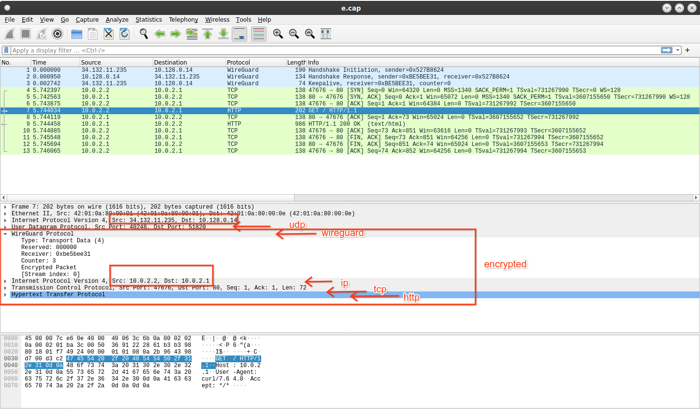

---
## Front matter
title: "Реферат по теме: «Виртуальные частные сети»"
subtitle: "по дисциплине: Информационная безопасность"
author: "Ким Михаил Алексеевич"

## Generic otions
lang: ru-RU
toc-title: "Содержание"

## Bibliography
bibliography: bib/cite.bib
csl: pandoc/csl/gost-r-7-0-5-2008-numeric.csl

## Pdf output format
toc: true # Table of contents
toc-depth: 2
lof: true # List of figures
lot: false # List of tables
fontsize: 12pt
linestretch: 1.5
papersize: a4
documentclass: scrreprt
## I18n polyglossia
polyglossia-lang:
  name: russian
  options:
	- spelling=modern
	- babelshorthands=true
polyglossia-otherlangs:
  name: english
## I18n babel
babel-lang: russian
babel-otherlangs: english
## Fonts
mainfont: PT Serif
romanfont: PT Serif
sansfont: PT Sans
monofont: PT Mono
mainfontoptions: Ligatures=TeX
romanfontoptions: Ligatures=TeX
sansfontoptions: Ligatures=TeX,Scale=MatchLowercase
monofontoptions: Scale=MatchLowercase,Scale=0.9
## Biblatex
biblatex: true
biblio-style: "gost-numeric"
biblatexoptions:
  - parentracker=true
  - backend=biber
  - hyperref=auto
  - language=auto
  - autolang=other*
  - citestyle=gost-numeric
## Pandoc-crossref LaTeX customization
figureTitle: "Рис."
tableTitle: "Таблица"
listingTitle: "Листинг"
lofTitle: "Список иллюстраций"
lotTitle: "Список таблиц"
lolTitle: "Листинги"
## Misc options
indent: true
header-includes:
  - \usepackage{indentfirst}
  - \usepackage{float} # keep figures where there are in the text
  - \floatplacement{figure}{H} # keep figures where there are in the text
---

# Цель и задачи работы

Изучить основные VPN протоколы. Сравнить эффективность и защищенность их работы.

# Теоретическое введение

## VPN

**VPN (Virtual Private Network)** — виртуальная частная сеть — широко распространённая технология, позволяющая организовывать виртуальные сети поверх существующих реальных сетей. Построение VPN-а означает создание туннелей. Под туннелем подразумевается канал между двумя устройствами, по которому передаётся данные. Важное условие – данные изолированы от особенностей построения канала. Устройство, передающее полезные данные делает это таким образом, будто никакого туннеля нет, а настройка самого туннеля при этом выделяется в отдельную задачу. 

Существует два типа VPN туннелей:

- Remote access VPN – туннель организуется между приложением на компьютере клиента и каким-либо устройством, которое выступает в качестве сервера и организовывает подключения от различных клиентов (например, VPN-концентратор, маршрутизатор, Cisco ASA и т.п.).

- Site-to-site VPN – подразумевает наличие двух устройств (например, маршрутизаторов), между которыми имеется перманентный туннель, в этом случае, пользователи находятся за устройствами, в локальный сетях и на их компьютерах не требуется установки какого-либо специального программного обеспечения [@bib_1].

### Принцип работы

Принци работы VPN-протокола можно кратко описать следющим образом:
1. Отправитель шифрует исходный IP пакет (ничего не меняя в самом пакете) заранее согласованным алгоритмом шифрования. Затем добавляет дополнительную информацию в виде заголовков. После этого данный пакет инкапсулируется в новый IP пакет с новыми IP адресами.

2. Получатель совершает обратную процедуру. Он извлекает зашифрованный пакет с VPN заголовком. Затем удаляет сам VPN заголовок и дешифрует исходный пакет. После этого пакет отправляется во внутреннюю сеть (рис. @fig:01).

{#fig:01 width=86%}

Таким образом, общий порядок инкапсуляции, в случае использования site-to-site VPN следующий: пользователь отправляет обычный пакет, пакет доходит до устройства, на котором поднят туннель, устройство заворачивает этот полезный пакет в поле «data» протокола инкапсуляции, который, в свою очередь заворачивается в поле «data» транспортного протокола. После чего из устройства выходит с виду обычный, например, ip пакет, в котором, на самом деле, в поле с полезными данными содержится GRE-пакет, в котором, в свою очередь, содержится другой внутренний IP пакет. Это позволяет использовать независимую адресацию внутри туннеля и снаружи туннеля. Когда целевое устройство получает такой пакет, оно разворачивает его, декапсулируя из него GRE и потом внутренний IP пакет. После чего внутренний пакет направляется получателю. В данной ситуации, как не сложно догадаться, отправитель и получатель ничего не знаю о наличии туннеля, и работают так, как будто бы его нет. При этом в транспортном протоколе используется одна адресация (например, публичные IP адреса), а в транспортируемом протоколе могут использоваться приватные адреса, что не мешает ему транспортироваться через интернет (так как маршрутизация осуществляется для внешнего, транспортного пакета) [@bib_2].

### Приватность VPN

При использовании VPN предоставитель интернет-услуги имеют информацию о том, что какие-то данные отправляются на удаленный сервер. Что содержат пакеты и какому серверу они посылаются дальше – предоставитель услуг не может знать..

Сервер, которому посылается запрос через VPN будет считать, что запросы посылаются непосредственно с VPN-сервера [@bib_3].

## Обфускация

Обфускация – приведение исходного текста или исполняемого кода программы к виду, сохраняющему её функциональность, но затрудняющему анализ, понимание алгоритмов работы и модификацию при декомпиляции [@bib_4].

## DPI

**Deep Packet Inspection (DPI)** — глубокая проверка пакетов — технология проверки сетевых пакетов по их содержимому с целью регулирования и фильтрации трафика, а также накопления статистических данных. В отличие от брандмауэров, Deep Packet Inspection анализирует не только заголовки пакетов, но и полезную нагрузку, начиная со второго уровня модели OSI [@bib_5].

# Рассмотрение протоколов
## OpenVPN

**OpenVPN** — свободная реализация технологии VPN с открытым исходным кодом для создания зашифрованных каналoв типа точка-точка или сервер-клиенты между компьютерами. Особенности OpenVPN:

1. Сравнительно небольшая скорость работы.
2. Возможность выбора между TCP и UDP протоколами для передачи трафика.
3. Слабая устойчивость к блокировкам со стороны DPI [@bib_6].

## IPsec/IKEv2

VPN-протоколы с открытым исходным кодом. Устройчивы к смене сетей, что желательно для смартфонов (при переключении между точками и мобильным интернетом). Особенности IPsec/IKEv2

1. Сравнительно небольшая скорость работы (однако быстрее, нежели OpenVPN).
3. Слабая устойчивость к блокировкам со стороны DPI [@bib_7].

## WireGuard

**WireGuard** — быстрый и высокопроизводительный VPN-протокол с открытым исходным кодом, использующий современную криптографию. Особенности WireGuard:

1. Высокая скорость работы по сравнению со всеми существующими VPN-протоколами.
2. Работа посредством UDP-протокола.
3. Отсутствие устойчивости к блокировкам со стороны DPI.

Возможная проблема использования WireGuard заключается в том, что по первым байтам приветственного пакета данный протокол легко отличается от обычного интернет трафика, и, соответственно, легко блокируется поставщиком интернет-услуг (рис. @fig:02) [@bib_8].

{#fig:02 width=86%}

## Shadowsocks

**Shadowsocks** — туннельный прокси с обфускацией, предназначенный для обхода блокировок со стороны провайдера и/или государства посредством DPI. Особенности Shadosocks:

1. Относительно низкая скорость работы.
2. Эмуляция VPN-туннеля посредством прокси с обфускацией.
3. Уязвимость к replay-атакам и атаками методом active probing.
4. Устарел и более не поддерживается.

## Shadowsocks-2022

**Shadowsocks** — одна из ветвлей развития оригинального Shadowsocks. Является наиболее актуальной и защищенной версией базового прародителя. Особенности Shadowsocks-2022:

1. Все еще относительно низкая скорость работы.
2. Эмуляция VPN-туннеля посредством прокси с обфускацией.
3. Отсутствие уязвимости к replay-атакам и атаками методом active probing.
4. Крайне сложное детектирование протокола методом удара по радиусу.

## V2Ray

V2Ray/V2Fly/XRay — фреймворки, работающие с протоколами:

1. VMess — устарел, не используется. Для сокращения размера реферата рассматривать его не вижу смысла.

2. VLESS — при обмене пакетами осуществлят проверку "свой/чужой" паддинг данных (изменение размеров пакетов для затруднения детектирования паттернов траффика). В протоколе исправлен ряд уязвимостей старого VMess, и он активно развивается - например, автор планирует добавить поддержку компрессии алгоритмом Zstd - не сколько для производительности, сколько для затруднения анализа “снаружи”. При этом, при установлении соединения (хендшейке) клиент и сервер обмениваются версией протокола и списком поддерживаемых фич, то есть при дальнейшем развитии должна сохраняться обратная совместимость. В общем и целом, на сегодняшний день это самый свежий и прогрессивный протокол.

XTLS — одна из "фич" XRay. Прокси-сервер подслушивает передаваемый трафик, и если видит, что если между клиентом (например, браузером) и удаленным хостом (например веб-сервером) устанавливается TLS-соединение, то дожидается окончания хендшейка, и после чего перестает шифровать трафик, начиная передавать пакеты данных “как есть”. В итоге существенно снижается нагрузка на прокси-сервер и клиент, и что важнее - со стороны трафик выглядит гораздо менее подозрительно (у нас подключение по TLS, поэтому до сервера бегают простые TLS-пакеты без аномалий, никакого двойного шифрования).

TLS-Reality — самая передовая разработка от авторов XRay. Протокол уже поддерживается в master-ветке xray и даже в некоторых клиентах, но про него все еще мало что известно. В отличие от всех остальных вариантов, определение “свой/чужой” здесь происходит еще на этапе TLS-хендшейка в момент чтения ClientHello. Если клиент опознан как “свой”, сервер работает как прокси, а если нет TLS подключение передается на какой-нибудь другой абсолютно реальный хост с TLS (например, google.com или gosuslugi.ru), и таким образом клиент (или цензор, желающий методом active probing проверить, а что же прячется на том конце) получит настоящий TLS-сертификат от google.com или gosuslugi.ru и настоящие данные с этого сервера. Полное соответствие [@bib_9].

# Выводы

Изучил основные VPN протоколы. Сравнил эффективность и защищенность их работы.

# Список литературы{.unnumbered}

::: {#refs}
:::
